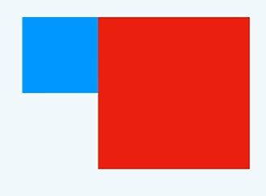
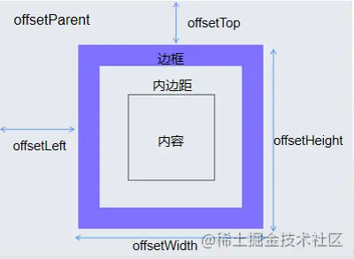
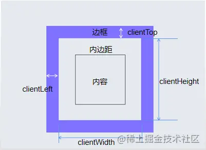
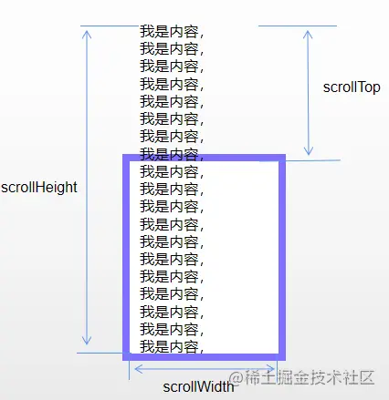

# HTML

##  meta 标签

~~~html
<!-- 关键字，搜所引擎 SEO -->
<meta name="keywords" content="关键字1,关键字2,...">
<!-- 页面描述，利于 SEO -->
<meta name="description" content="网页描述">
<!-- 手机端 视口 -->
<meta name="viewport" content="width=device-width, initial-scale=1, user-scalable=no, maximum-scale=1.0, minimum-scale=1.0" />
<!-- 规定响应头部：如每三十秒刷新一次页面 -->	
<meta http-equiv="refresh" content="30">
~~~

- name 属性表示将 content 属性关联到一个关键字上
- http-equiv 属性表示响应头部

- 视口meta：
  - 视口宽度和设备保持一致（width=device-width）
  - 不允许用户自行缩放（user-scalable=no）
  - 视口的默认缩放比例1.0（initial-scale=1.0）
  - 最大允许的缩放比例1.0（maximum-scale=1.0）
  - 最小允许的缩放比例1.0（minimum-scale=1.0）

## iframe 标签的缺点

1. 不利于网页的 SEO
2. iframe 和 主页面与服务器的 tcp 连接数上限按一个域名算，干扰性能。
3. iframe 的创建比等价的 scripts 和 css 的 DOM 元素慢很多， 会阻塞主页面的 load 事件。
   - 但是通过 JavaScript 动态设置 iframe 的 src 可以避免这种阻塞情况。
4. 不安全，且目标网站不一定让你使用。

## link 标签

一般最常使用的是加载 css 样式

~~~html
<link rel="stylesheet" href="styles/main.css">
~~~

此外，还能进行一些资源的加载：

- preload 强制浏览器请求资源，用于声明哪些资源是在`首次页面加载完后就立即需要`的：
  - 将资源的加载和执行分开，提高首屏加载速度，如果是 js 文件加载完后不会自动执行脚本。
  - 使页面加载早期就开始获取，且`不会阻塞渲染和 load 事件`的最有效的方法。
  - 如果提取的资源**3s内**未在当前使用，在谷歌开发工具将会触发警告消息
  - 其中as属性指定资源的类型后，浏览器可以更加精确地优化资源加载优先级，也可以发送适当的 accept 请求头；没有 as 的话，都会被当成 XHR 请求，优先级较低。
  - 注意 preload 加载的资源如果跨域了，需要加上 crossorigin 属性，否则可能会导致 icon 资源的两次加载

~~~html
<link rel="preload" href="style.css" as="style">
<link rel="preload" href="main.js" as="script">
~~~

- prefetch / dns-prefetch 
  - prefetch ：空闲时加载，优先级低。
  -  dns - prefetch 预解析 DNS 域名查询
- 预渲染 （prerender）将下载的 HTML 文件预先在后台渲染。
  - 预渲染虽然可以提高页面的加载速度，但是要确保该页面大概率会被用户在之后打开，否则就是白白浪费资源去渲染。

~~~html
<link rel="prerender" href="http://example.com"> 
~~~

# CSS

## Css 选择器及其优先级

| 选择器                       | 优先级  |
| ---------------------------- | ------- |
| 继承 、默认样式、*           | 0,0,0,0 |
| 标签（元素）、`伪元素选择器` | 0,0,0,1 |
| 类、伪类、`属性选择器`       | 0,0,1,0 |
| ID选择器                     | 0,1,0,0 |
| 行内样式                     | 1,0,0,0 |
| 后加 !important              | 无穷大  |

复合选择器权重虽然会有叠加的效果，但是不会进位

选择器：

~~~js
属性选择器（a[rel="external"]）
在css3中使用单冒号来表示伪类，用双冒号来表示伪元素。
~~~

注意：伪元素创建的元素==不在文档树中==

##  css 隐藏页面元素的几种方式

| 方式               | 说明                                                         |
| ------------------ | ------------------------------------------------------------ |
| opacity: 0         | 通过将元素的==透明度设置为0==，实现看起来隐藏的效果；但是依然会占用空间并可以进行交互 |
| visibility: hidden | 与透明度为0的方案非常类似，会占据空间，但==不可以进行交互==  |
| display: none      | ==从文档流中消失==                                           |

## 元素水平垂直居中

1. 标准流元素，父元素设置了指定的宽度，设置`margin:0 auto; line-height: 父盒子高度;`
2. 设置元素为行内块元素，设置`text-align: center; line-height: 父盒子高度;`
3. 设置父盒子为 flex 盒子。使用`justify-content: center; align-items: center;`使子元素在主轴和侧轴上居中排列
4. 使用定位，父绝子相。`left: 50%; top: 50%; transform: translate(-50%, -50%); `

为什么 margin : auto 不能实现垂直居中？

W3C规定，top，bottom设置为auto，其实默认值为0。

##  清除浮动

1. 在最后的位置新加一个空的 div 盒子，设置`clear: both`样式
2. 给父元素添加 `overflow: hidden`触发 BFC；
3. 添加一个伪元素清除浮动

~~~css
.clearfix:after {
  content: "";  			/*设置内容为空*/
  display: block;			/*将文本转为块级元素*/
  visibility: hidden;	    /*保证看不见*/
  clear: both; 				/*清除浮动*/
}
~~~

## 外边距合并问题

（==注意只有上下的外边距会导致外边距合并的问题==）

1. 相邻元素外边距合并（两个盒子的外边距值不会相加，而是取较大值）: 给两个盒子的父盒子其中一个添加`overflow: hidden`
2. 父子元素同方向的外边距塌陷（父元素和子元素的外边距值不会相加或分别计算，而是取较大值）：可以给父元素添加`overflow: hidden`

## 盒子模型

`box-sizing: content-box`（默认）

`box-sizing: border-box`：盒子设置宽高会包含 ==content+ padding + border==（不包含 margin）。

## css 三角形

​	首先设置一个盒子宽高为0，边框设置宽度，然后四个方向的边框不需要的就设置透明就行了。

~~~css
.box {
    width: 0;  
    height: 0;  
    /* 只保留右边的边框有颜色 */ 
    border-top: 100px solid transparent; 
    border-right: 50px solid skyblue;
    border-bottom: 0 ；  
    border-left: 0 ；
~~~

## 行内块元素出现空白缝隙

直接将父元素设置 `font-size: 0px;`即可。子元素也可以重新设置回字体大小。

## CSS过渡

`transition: 要过渡的属性  花费时间  [运动曲线]  [何时开始] ;`

JS 动画相比于 CSS 过渡：

1. 占用 JS 主线程
2. 代码复杂
3. 控制能力强

## BFC

​	BFC 直译为"块级格式化上下文"。它是一个独立的渲染区域，只有块级盒子参与， 并且`这个区域外部毫不相干`。

- BFC 属于标准流布局。当元素触发了 BFC ，就可以堪称一个独立的渲染区域

- 常见的触发BFC的条件：

  - 根元素`<html>`
  - 浮动的元素
  - 除了static的定位
  - 行内块元素
  - `overflow`不为 `visible` 的元素

- BFC 特性：

  - 会避免外边距合并问题（将两个盒子中一个触发BFC即可）
  - 可以清除浮动
  - 实现==自适应布局==（左边固定，右边自适应）（原理是BFC 区域不会与浮动元素重叠）

  

## css 三大系列

offset 偏移系列（只读）

- offset 用于读，style 用于写，他们其实指的是同一个东西。 
- -width / -height 用于获取元素宽高（`border` + `padding` + ==滚动条==）， style.width 只能在行内脚本中读取到。

- -parent 指向一个最近的有定位的祖先元素
- -left / -top 获取当前元素==外边框==相对 offsetParent ==内边框==的偏移

client 可视区系列（只读）

- -height/width ： `padding` - 滚动条 (如果存在)
- -top/left ： 表示元素的边框的宽度

scroll （只读）

- -height/width ：等于该元素在不使用滚动条的情况下所需的最小高度，包括 padding 但不包括 border。
- -top/left：获取或设置一个元素的内容垂直滚动的像素数（被卷去的距离），没有滚动条则值为 0，`可以写入`

## 媒体查询

根据不同的屏幕尺寸，显示不同的效果（响应式布局）

通过查询媒体功能的表达式，使得满足条件时对应的样式生效。

~~~css
@media 媒体类型 and (条件1) and (条件二){
    样式
}
 例如：
@media screen and (min-width: 768px) and (max-width: 991px) {
  .container {
    width: 750px;
  }
}

也可以用在 link 标签上，表示条件引入样式
<link rel="stylesheet" type="text/css" href="index02.css" media="screen and (max-width:720px)"/>
~~~

## flex 布局

flex 布局相比于浮动布局等，渲染效率更高， 是浏览器提倡的布局方式

设为Flex布局以后，子元素的float、clear和vertical-align属性将失效。

1. 基本语法：

~~~css
1. 调整主轴方向
flex-direction: row | column | row-reverse | column-reverse

2. 设置容器在一条轴线排不下的时候是单行还是多行
flex-wrap:
	nowrap： 不换行（默认），如果宽度溢出，会压缩子盒子的宽度。
	wrap： 当宽度不够的时候，会换行。

3. 主轴的对齐方式
justify-content: 
    flex-start: 弹性盒子元素将向起始位置对齐
    flex-end: 弹性盒子元素将向结束位置对齐。
    center: 弹性盒子元素将向行中间位置对齐
    space-around: 弹性盒子元素会平均地分布在行里
    space-between:第一个贴左边，最后一个贴右边，其他盒子均分，保证每个盒子之间的空隙是相等的。

4. 单行侧轴的对其方式
align-items:
	flex-start： 元素在侧轴的起始位置对齐。 
    flex-end： 元素在侧轴的结束位置对齐。
    center： 元素在侧轴上居中对齐。
    stretch： 元素的高度会被拉伸到最大（子元素没有高度时, 才拉伸）。

5. 多行侧轴的对齐方式
align-content
    flex-start： 各行向侧轴的起始位置堆叠。 
    flex-end： 各行向弹性盒容器的结束位置堆叠。
    center： 各行向弹性盒容器的中间位置堆叠。
    space-around： 各行在侧轴中平均分布。 
    space-between： 第一行贴上边，最后一个行贴下边,其他行在弹性盒容器中平均分布。 
    stretch：拉伸，不设置高度的情况下。

6、flex 属性：
flex:flex-grow flex-shrink flex-basis;

flex-grow 属性用于设置放大比例，默认为0，即如果存在剩余空间，也不放大。如果所有项目的flex-grow 属性都相同，则它们将等分剩余空间（如果有的话）。如果一个项目的flex-grow属性为2，其他项目都为1，则前者占据的剩余空间将比其他项多一倍。

flex-shrink 属性指定了 flex 元素的缩小属性，默认为1，即如果空间不足，该项目将缩小。如果所有项目的flex-shrink属性都为1，当空间不足时，都将等比例缩小。如果一个项目的flex-shrink属性为0，其他项目都为1，则空间不足时，前者不缩小。

flex-basis属性定义了在分配多余空间之前，项目占据的主轴空间（main size）。浏览器根据这个属性，计算主轴是否有多余空间。它的默认值为auto，即项目的本来大小。
~~~

##  translate 2D转换

`transform: translate(x, y);`二位旋转

`transform: rotate(n)`二维旋转

- translate 最大的优点就是==不影响其他元素的位置==，占位还是在原来的地方，offeset 系列的值也不会变化
- translate 中的百分比单位，是==相对于本身==来进行计算的
- 行内元素没有效果
- 与绝对定位区别：
  - 绝对定位不会创建一个新的图层，会触发重绘；
  - 而 transform 会触发 css3 硬件加速，开启一个新的图层，不会触发重绘或回流。

## 两栏布局、三栏布局的实现

两栏布局：例如左边元素宽 200px 右边元素自适应宽度。

~~~css
（1）利用浮动，将左边元素宽度设置为200px，并且设置向左浮动。将右边元素的margin-left设置为200px，**宽度**设置为auto

（2）利用flex布局，将左边元素宽度设置为200px。将右的元素的 flex 设置为1

（3）第三种是利用绝对定位布局的方式，将父级元素设置相对定位。左边元素设置为absolute定位，并且宽度设置为200px。将右边元素的margin-left的值设置为200px。

（4）第四种还是利用绝对定位的方式，将父级元素设置为相对定位。左边元素宽度设置为200px，右边元素设置为绝对定位，左边定位为200px
~~~

三栏布局：如左边宽度为100px，右边宽度为 200px，中间元素自适应

~~~
（1）利用绝对定位的方式，左右两栏设置为绝对定位，中间设置对应方向大小的margin的值。

（2）利用flex布局的方式，左右两栏指定宽度，中间一栏设置flex : 1

（3）利用浮动的方式，左右两栏设置固定大小，并设置相应的左右浮动。中间一栏设置左右两个方向的margin值
	注意这种方式，中间一栏必须放到最后（因为中间的元素还是标准流）。

（4）圣杯布局，利用浮动和负边距来实现。
	父级元素设置左右的 padding，三个子元素均设置向左浮动，中间一列放在最前面，宽度设置为100%，因此后面两列都被挤到了下一行，通过设置 margin 负值将其移动到上一行，再利用相对定位（绝对定位会使浮动属性失效，而相对定位不会）（不能使用 transform ，因为不会改变元素的占位） ，定位到两边。
（5）双飞翼布局
	中左右三个元素分别左浮动，中间元素宽度 100% 并设置左右边距，左元素设置左边距为-100%以使得左元素上升一行并且处于最左位置，右元素设置左边距为自身宽度的负值使得右元素上升一行处于最右位置。 
~~~

圣杯布局和双飞翼布局的优势在于：中间部分在DOM结构上优先，以便先行渲染

## 响应式布局

1. 媒体查询：条件加载 css 样式
2. rem 布局： 配合 js 或 rem 布局动态修改 rem 大小实现
3. vm 视口单位： `css3`中引入了`vw`表示相对于视图窗口的宽度，`vh`表示相对于视图窗口高度，还有`vmin`和`vmax` 用以表示 vw 和 vh 两者的较大值和较小值。（缺点是没有最大最小宽度的限制）
   1. 可以像 rem 布局一样用 rem 做单位写所有的样式
   2. 也可以将 rem 设置成 vm 单位，并且对 body 元素 设置 max-width 和 mid-width 来进行极端情况的限制。
