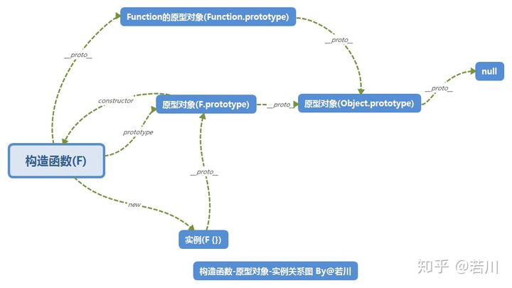

# 简单数据类型及类型转换

##  数据类型

​	数据类型分为七种简单数据类型（undefined、null、Boolean、number、string、symbol、bigInt（可以操作大整数而不丧失精度））和一种复杂数据类型（Object）


注意：

1. isNaN函数用于表示传入的参数==能不能转换成数值==；而 Number.isNaN 方法只会判断是不是 NaN，不会尝试进行转换。
2. NaN也是数字类型，表示本来要返回数值的操作失败了（代替了报错）
3. **js 中的字符串类型不可变**
5. 不能使用严格相等运算符将`BigInt`与常规数字进行比较，因为它们的类型不同：


## js 的几种数据类型检测

1. typeof ：一般用于判断基本类型，返回的字符串没有 null （**type of null 得到的结果是 object 因为js把它看成一个空对象**），且多了 function。
2. instanceof：用于判断复杂数据类型（通过原型链）
3. Object.prototype.toString.call() ： 返回的值是`[object [type]]` 其中 type 就是该对象的类型（==内部属性 [[Class]] 的值==）（所有 typeof 返回值为 "object" 的对象都会包含一个内部 `[[class]]`属性）（此外 undefined 和 null 返回 Undefined 和 Null）


## 类型转换

在 JS 中类型转换只有三种情况，分别是：

1. 转化为 Number 类型：`Number()` / `parseFloat()` / `parseInt()`。**隐式转换成数字类型的都是通过 Number 函数转换的**

~~~js
// 特别注意以下特殊情况：
Number(null)                   // 0
Number(undefined)              // NaN
Number(true)                   // 1
Number(false)                  // 0
Number('')                     // 0

// 字符串
Number(" 12 ")                 // 12
Number("-12.34")	           // -12.34 第一个是正负号也可以转换
Number(" \n")                   // 0 等价于空字符串
// Number 会删除前尾空格、\n、\t 字符，如删除后不成为一个有效的数字，则返回 NaN；

Number(" 12s ")                // NaN
parseInt(" 12s ")              // 12
// 两者的区别是如果第一个字符是数字，parseInt 会继续解析直至字符串解析完毕或者遇到一个非数字符号为止，而 Number 则是 NaN
~~~

`["1","2","3"].map(parseInt)`结果是与 `[1, NaN, NaN]`，因为parseInt接受两个参数，第一个是需要转化的对象，第二个是基于几进制转换（2 ~ 36），默认是十进制。


2. 转化为 String 类型：`String()` / `toString()`。隐式转换会在表示字符串拼接的 + 号触发。

`String()` / `toString()`的区别：==null/undefined 没有toString 方法==。

~~~js
String(123)  //          数字：      '123'
String(-12.3)  //        浮点数字：   '-12.3'
String(NaN)  //        	 NaN：       'NaN'
String(null)  //         null：      'null'
String(undefined)  //    undefined： 'undefined'
String(false)  //        布尔值：     'false'
~~~


3. 转化为 Boolean 类型: `Boolean()`（除了 `undefined`，`null`，`false`，`NaN`，`''`，`0`，`-0`，其他所有值都转为 `true`，包括所有对象。）


## 对象转原始类型

内部的步骤：

- 调用 `x.valueOf()`，如果转换为了基础类型，就返回转换的值。**大多数 JS 内置对象类型的 valueOf() 只能返回这个对象本身**。
- 调用 `x.toString()`，然后再转换成需要的原始类型。

- 如果都没有返回原始类型，就会报错

一般来说，我们只需要记住几种对象的 toString 方法（如果转化为 number 就是先转 string，然后转 number）：

1. 函数 =>  函数源码
2. 对象 => `'[object Object]' ` 
3. 数组 => 用逗号分隔的数组元素或空字符串


## 相等操作符

- undefined 的值是 null 两者==表面==相等（ == 是true， === 是false）
- ==NaN不等于包括在NaN以内的任何数值==（NaN == NaN 为 false）
- null 和 undefined 不能转换成任何值进行比较，即 null、 undefined不会严格等于除了自身的任何值（与自身则是严格相等，与对方则是表面相等）


**== 运算符的隐式转换**

1. 首先会判断两者类型是否相同。相同的话就直接比较。类型不相同的话，那么就会进行类型转换。
2. 先判断是否在对比 `null` 和 `undefined`，是的话就会返回 `true`。
3. 再者如果两边都是简单类型，就==都转换成 number 类型进行判断==。

4. 如果一方有复杂类型，则将其转换成简单类型再比较，

5. 如果两边都是对象，则只会比较指针（两个对象永远不可能相等，只有一个指针等于另一个指针）

~~~js
'a' + + 'b' // -> "aNaN"
// 一元 + 运算符比二元 + 运算符具有更高的优先级。所以 + b表达式先求值。
// 一元加号执行字符串“b” 的 number 类型转换。因为字符串不代表一个有效的数字，所以结果是NaN
// NaN 转换为字符串为 'NaN'


'true' == true // false
'false' == false // false
// 一方是布尔值，将其转换为数字 1 和 0，转换完成后，另一边字符串转为数值 NaN，所以不相等。
// 也可以理解为简单数据类型都会转换为数字进行比较

['x'] == 'x'  // true
// == 运算符对数组类型执行 number 转换，先调用对象的 valueOf() 方法，结果是数组本身，不是原始类型值，所以执行对象的 toString() 方法，得到字符串 'x'

[] + null + 1  // 'null1'
// '+' 运算符执行 number 类型转换，先调用对象的 valueOf() 方法，结果是数组本身，不是原始类型值，所以执行对象的 toString() 方法，得到字符串 ''， 接下来执行表达式 '' + null + 1。
~~~


## 如何判断两个对象相等

~~~js
// 1. 将两个对象转化为 JOSN 字符串进行比较。
// 缺点：两个对比的对象中key的顺序有可能不相同，比较就会出错。
// 此外，如果一个对象有循环引用自身则转换时会报错。
JSON.stringify(obj1) === JSON.stringify(obj2)

// 2. 将两个对象所有的 key 值使用 Object.getOwnPropertyNames方法取出为一个数组，循环进行判断。这样避免了不同顺序的可能性。
let keys1 = Object.getOwnPropertyNames(obj1);
let keys2 = Object.getOwnPropertyNames(obj2);
return keys1.every(key => {
        const type = typeof obj1[key];
    	// 遇到引用类型只会比较存储的类型是否相等（浅比较）
        if (['function', 'array', 'object'].includes(type)) {
            return type === typeof obj2[key];
        }
        if (obj1[key] !== obj2[key]) {
            return false;
        }
        return true;
    });
// 3. 利用深拷贝的思想递归属性中的复杂数据类型进行判断（与上面大体一致）
~~~


## symbol （符号）

​	符号实例是`唯一、不可变`的。符号的用途是确保对象属性使用唯一标识符，而不会发生属性冲突的风险。他是一种非字符串的**对象属性**，使用它只需要调用工厂函数实例化一个 symbol`Symbol() `（注意它不是 new 调用） ，并将其用作对象的新属性即可。

​	symol 的另一个作用是通过 Symbol 这个默认的工厂函数上的一些属性来读取默认的一些方法。如 迭代器、内部 class 等。


#   复杂数据类型

## 内存中的堆和栈：

- 内存中的栈：存放函数的参数值、局部变量的值等简单数据类型。
- 内存中的堆：存储复杂类型，由垃圾回收机制进行回收释放


## 原始包装类型

​	String、Number 、Boolean 这三种原始数据类型，他们本应该没有属性或方法，但是事实证明是有的。因为JS**在后台进行了包装**。注意：无法人为的给改实例或构造函数进行修改。
​	在需要调用原始值的属性或方法时，会进行包装尝试获取该属性或方法，包装的步骤：

1. 创建一个 如String类型的实例
2. 调用实例上特定的方法
3. 销毁该实例

~~~js
let s1 = 'abc';
let s2 = s1.substring(2);

// 可以想象成在第二行进行了如下操作
let s1 = new String('abc');
let s2 = s1.substring(2);
s1 = null;
~~~


##  对象的遍历方法

for-in for-of 遍历的区别：

- for in 可以用于遍历可枚举对象（Array/ Object/ String） ，缺点：遍历数组时，可能会出现随机顺序的遍历，且键为字符串型数字，因为他也将数组看成了对象进行遍历。

- for of 可以用于遍历可迭代对象（Array/ String/ Map/ Set）。


对象的几种迭代方法：

- `for-in` 
  - 以任意顺序遍历一个对象的==可枚举属性但不包含symbol==。
  - ==会遍历原型上的属性==，因此需要通过 `Object.haoOwnProperty` 来过滤

- `Object.keys()` 方法
  - 返回一个给定对象的自身==可枚举属性但不包含Symbol属性==组成的数组，
  - 数组中属性名的排列顺序和 for-in 遍历返回的顺序一致 。
  - ==不会获得原型上的属性==

- `Object.getOwnPropertyNames()`方法
  - 返回一个由指定对象的所有自身属性的属性名（==包括不可枚举属性但不包括Symbol属性==）组成的数组，
  - 数组中属性名的排列顺序和使用 for-in 循环遍历该对象时返回的顺序一致 。
  - ==不会获得原型上的属性==

(对象的可枚举性的作用主要就是在希不希望被遍历到这一点上)


## Array

1. Array.isArray() 方法比 instanceof 方法：
   1. 可以跨 iframe 判断（instanceof 只假定了单一的全局执行环境，并通过原型链判断，但是==实例的Array构造函数可能与用于测试的Array构造函数不同==；而 isArray 方法是通过 内部 [[ class ]] 判断的（相当于 Object.toString 的封装））。

2. Array.from() 方法 ：将可迭代结构（包括数组）变为数组结构；因此能也能实现数组的浅复制。
3. 迭代方法：每个方法都接受两个参数：一个是每一项都运行的一个函数（该函数的参数：`当前元素，当前索引，原数组本身`），另一个指定为该函数的 this 值的对象（没有则是 window）.
   - every()： 如果每一项函数都返回true，则这个方法返回true；否则返回 false，且一旦一项为 false ，就不会继续迭代该数组，`不会改变原数组`
   - filter()：返回一个在迭代中函数返回值为true的元素组成的新数组并返回，`不会改变原数组`
   - forEach()：原数组每一项都执行函数，没有返回值
   - map()：返回每一次函数调用的结果构成的`新数组`，`不会改变原数组`
   - some()：如果存在一项函数返回true，则停止迭代并返回true；否则返回false。该方法`不会改变原数组`
4. 填充方法：`arr.fill(3, 2, 4)`。第一个参数是需要填充于该数组的元素，第二个参数（可选）表示起始位置，第三个参数为结束位置（可选）。该区间是`左闭右开`。
   - `fill`会将括号内的值重复使用，因此引用类型使用 fill 赋值后只能是赋值指针。
5. 操作方法：
   - concat()方法：`浅拷贝`当前数组，将参数添加到该副本的末尾并返回。`不会改变原数组`
   - slice()方法：返回一个浅复制了原数组的某个片段的一个新数组。区间左闭右开`不会改变原数组`
   - splice()方法：将可以删除，插入，替换原数组元素,并以数组的形式返回被删除的数组元素，如果没有返回空数组，`会改变原数组元素`。
     - 删除，第一个参数是起始位置，第二个要删除的元素数量
     - 插入，第一个参数是开始位置，第二个是删除的数量(0)，第三个是要插入的元素
     - 替换，第一个参数是开始位置，第二个是删除的数量，第三个及以后的参数是要插入的元素
6. 搜索方法：搜索方法是进行`严格相等`的匹配的
   - includes()方法 返回布尔值 
   - indexOf()  第一个参数是要查找的元素，第二个参数可选，是查找的起始位置。`返回索引值`，没有找到返回-1。
   - lastIndexOf() 方法类似前者，但是是从后往前找
7. 归并方法：可以将数组中的元素通过回调函数最终转换为一个值。
   - 方法传入两个参数，一个是每一项都运行的归并函数，另一个是初始值（可选）
   - 其中函数的参数是：上一个归并值、当前项、当前项的索引、数组本身
   - 上一个函数的返回值会作为下一个函数的第一个参数（归并值）
   - 如果没有初始值参数，会从第二个元素开始归并，函数第一个参数是第一个元素，第二个参数是第二个元素；（表示初始值是第一个元素，从第二个元素开始归并）
   - 如果有初始值参数，则函数的第一个参数是该初始值，第二个参数是数组第一个元素

```js
let values = [1, 2, 3, 4, 5];
let sum = values.reduce((pre, cur, ind, arr) => pre + cur)
// 因为有pre 这个参数存在，所以是从第二个开始进行归并
```

8. 排序方法：`sort()`方法
   - 会默认按照==从小到大==的顺序排列（==将每个元素通过 String() 方法转换成字符串进行比较==）
   - 参数接受一个比较函数，比较函数接受前后两个数组元素为参数，如果参数1 应该在 参数2后面，返回负数；相等返回 0；参数1 应该在 参数2 前面，返回正数
   - 调用完后返回原数组的==引用==（会改变原数组）

~~~js
arr.sort( (a, b) => a - b );
~~~

- 初始化数组（因为直接 new Array 并指定长度 ，==返回的是一个不可迭代的只具有长度的空数组==，使用fill可以让它能被迭代（未定义的 undefined 和 赋值undefinded 的意义是不同的）。


## Map

- Map：ES6新增数据结构，是一种真正实现键/值存储机制的映射，类似于Object。使用 new 实例化时可以将一个可迭代对象传入
- API： get()和 has()方法进行查询；size属性获取映射的数量；delete()和 clear()删除值
- 与 Object 的区别：
  - Map能使用任何数据类型作为键。一个 Object 的键只能是 字符串 或者  Symbols
  - Map==会维护键值对的插入顺序==，并根据这个顺序进行迭代。而对象则是无序的。
  - 可以通过 `size` 属性直接获取一个 `Map` 的键值对个数，而 `Object` 的键值对个数只能手动计算。
  - `Map` 可直接进行迭代，而 `Object` 的迭代需要先获取它的键，然后再进行迭代。


## Set

​	ES6新增的集合数据类型。可以理解为相较于 map 键和值是一样的。使用 new 实例化时可以将一个可迭代对象传入

​	API：add() 添加值，has()查询，size获得元素数量，delete()和clear()删除元素

​	数组去重：`Array.from(new Set(arr))`

​	`set`是一个键的集合，且set 的键是唯一的。它会维护插入的顺序。

​	相较于数组，按照某个项来进行查找，数组需要遍历，而set 会直接得到。


## WeakMap 和 WeakSet

WeakMap 的键 和 WeakSet 的 value 只能是对象，否则会报错

WeakMap 的键 和 WeakSet 的 value 不会阻止垃圾回收。

同时因为键值对随时会被删除，因此他是不可迭代对象且无法一次获取他的所有键值


## proxy

代理是目标对象的抽象，目标对象既可以被直接操作，也可以通过代理。但是直接操作会跳过代理施予的行为。

代理的主要用途是==捕获器==，对代理对象进行操作，会在传递给目标对象时通过代理的捕获器，进行一些需要的中间操作。

而==默认的捕获器的行为==被定义在了 Reflect 对象上，当自己手写捕获器而需要默认行为时，就可以免于手写默认行为而使用 Reflect 对象了。


## 垃圾回收机制

​	基本思路：确认哪个变量不会再使用，然后释放它占用的内存。这个过程是周期性的，会自动运行。但是它是一个不完美的方案，因为无法确定某块内存是否还有用。

​	垃圾回收程序必须跟踪记录哪个变量还会使用，哪个不会。至于如何标记未使用的变量，有两种标记策略：

- 标记清理：垃圾回收器标记全局作用域中的所有变量，然后依次访问并标记所有该全局作用域变量的引用，以及子代的子代的引用..…，直到没有可以继续访问的对象为止。此时没有标记的对象都会被删除（因为任何全局作用域中的变量都无法访问到他们了）
- 引用计数：思路是对每个值都记录它被引用的次数，当引用数为0时可以回收。但是比较非主流，bug多，如循环引用就不会被清理。


#  对象

## 对象属性的内部特性

js 对象使用一些内部特性来描述属性的特征。

我们使用 `Object.defineProperty() / Object.defineProperties()`方法修改默认特性。使用`Object.getOwnPropertyDescriptor()/ Object.getOwnPropertyDescriptors()`方法取得指定属性的属性描述符。

```js
Object.defineProperty(o3, name, {value: 'nihao'});
Object.defineProperties(o4, {
    name: {value: 'nihaoma'},
     mama: {value: 'nihaomama'}
});
// 返回值是一个对象，有四个属性（分情况，数据属性和访问器属性）
Object.getOwnPropertyDescriptor(o3, name);
// 返回值是一个嵌套的对象，第一层 key 为 属性名， value 为一个 描述符对象
Object.getOwnPropertyDescriptor(o4);
```


1. 数据属性
   - `[[Configurable]]`：表示属性是否可以通过 delete 进行删除并重新定义、或者是否可以修改它的特性，以及能否把他改为==访问器属性==。默认为 true。一个属性被设置为不可配置后无法变回可配置的属性。
   - `[[Enmuberable]]`：表示属性是否可枚举（可以通过 for-in 循环返回）。默认为 true
   - `[[Writable]]`：表示属性的值是否可以被修改。默认为 true
   - `[[Value]]`：属性的实际值
   - 如果调用了`Object.defineProperty() / Object.defineProperties()`方法，且没有指定前三者的值，则都默认指定为 false
2. 访问器属性：这种属性没有值，它的意义在于进行访问或写入时执行一些操作，一般用作类似框架的 计算属性 （vue2 的实现原理）                                                                                                                                                                                                                                                                                                                                                       。只定义获取函数意味着函数是只读的，尝试写入值会被忽略；只定义设置函数则表示属性是不能读取的。
   - `[[Configurable]]`：表示属性是否可以通过 delete 进行删除并重新定义、或者是否可以修改它的特性，以及能否把他改为==数据属性==。默认为 true。一个属性被设置为不可配置后无法变回可配置的属性。
   - `[[Enmuberable]]`：表示属性是否可枚举（可以通过 for-in 循环返回）。默认为 true
   - `[[Get]]`获取函数，在读取属性时被调用。
   - `[[Set]]`设置函数，在写入属性时被调用。


## new

构造函数和普通函数没有区别，任何函数使用 new 调用就是构造函数，不用new 调用就是普通函数。

使用new 操作符发生了什么

1. 内存中创建一个新对象。
2. 将对象内部的 prototype 属性赋值为该构造函数的 prototype 属性
3. 构造函数内的**所有** this 值（包括其原型中的this）指向这个新对象并执行函数内部的代码（给新对象添加属性和方法）
4. 返回刚创建的对象


如果在构造函数中显式的return ：

1. 返回一个基本类型，不会有影响
2. 返回一个引用类型，会覆盖默认返回的实例对象。


### new.target

该属性一般用在构造函数之中，返回`new`命令作用于的那个构造函数。如果构造函数不是通过`new`调用的会返回`undefined`，这个属性可以用来确定构造函数是怎么调用的，也可以确定是被谁继承调用了。


## 原型链

- ==构造函数==：会给他创建一个 `prototype`（原型） 属性，指向原型对象；而所有原型对象默认获得一个 `constractor`（构造者） 属性，指向这个构造函数。
- ==实例==：将实例对象的 prototype 属性赋值为其构造函数的 `[[prototype]]` 内部属性（浏览器提供了实例对象的`__proto_`属性访问（非标准），或者通过 JS 的`Object.getPrototypeOf()`方法读取，通过`Object.setPrototypeOf()`修改）
- 当通过对象访问属性或方法时，会按照这个属性或方法的名称搜索。搜索开始于实例本身。如果没有，搜索会**沿着原型链向上查找**，而找到之后就不会继续向上找了（遮蔽）
- 默认情况下，所有引用类型（包括所有的原型对象）都被认为是` Object `构造函数的实例，因此其原型被指向`Object.prototype`，能够访问到其上的方法。而`Object.prototype`的原型指向 null 。
- 所有引用类型（包装类型）都在原型上定义了方法，只有null 和 undefined 没有原型。


- 可以看到构造函数同时拥有`prototype`和`__proto__`属性。因为其既是一个构造函数，也是 `Function`构造函数的实例。

  

  

## 继承

### 原型链实现继承

产生的问题：

1. 父构造函数的一个实例变成了所有子实例对象对象的原型，无法避免`属性共享`的情况了。

~~~js
function Father() {
    this.name = 'zs';
}

function Son() {}
Son.prototype = new Father();
Son.prototype.constructor = Son;

let son1 = new Son();
console.log(son1.name); // zs

// 只要修改了子实例的原型上的属性，其他属性都只能共享这个修改后的属性了
son1.name = 'ls'
console.log(son1.name); // ls

let son2 = new Son();
console.log(son2.name); // ls
~~~


2. 子构造函数内不能向父构造函数传参

~~~js
function Person(name,age,job){
    this.name = name;
    this.age = age;
    this.ob = job;
}

function Man(name,age,job,mustache){
    this.mustache = mustache;
    Man.prototype = new Person(name,age,job);
}

var m = new Man('Anthony',27,'PE');
m.name;//undefined
~~~


### 盗用构造函数实现继承

基本思路：在子类构造函数中调用父类构造函数。使用 apply()和 call()方法以新创建的对象为作用域执行构造函数。

~~~JS
function Father (){
    this.color = ['red', 'green', 'blue']
}
function Son (){
    Father.call(this)
}
let son1 = new Son();
son1.push('yellow');
console.log(son1.color); // ['red', 'green', 'blue', 'yellow']
let son2 = new Son();
console.log(son2.color); // ['red', 'green', 'blue']
~~~

​	盗用构造函数解决了子构造函数向父构造函数传参的问题、属性共享的问题。但是也导致了所有类型只能定义在构造函数中，无法复用的问题。


### 组合式继承

​	使用盗用构造函数的方式继承定义在父构造函数上的属性，并且使用原型链继承的方式继承父构造函数原型上的方法。

​	但是也存在一个缺点就是子类的原型上多了不需要的父类属性，存在内存上的浪费。

~~~js
function Father (name) {
    // 属性
    this.name = name;
    this.colors = ['red', 'green', 'blue'];
}
Father.prototype.sayName = function() {
    return this.name;
}
function Son (name, age){
    // 使用call方法继承属性
    Father.call(this, name);
    this.age = age;
}
// 使用原型链继承方法
Son.prototype = new Father();
Son.prototype.constractor = Son;

son = new Son('zs' 18)
console.log(son)
~~~


### 寄生式继承

​	寄生组合继承其实就是在组合继承的基础上，`解决了父类构造函数调用两次且原型上属性浪费`的问题。

~~~js
//父构造函数
function People(name,age){
  this.name = name；
  this.age = age；
}
People.prototype.eat = function(){
  return 'eat'
}

//子构造函数
function Woman(name,age){
  // 继承父构造函数属性：call 调用父构造函数
  People.call(this,name,age)
}
// 继承父构造函数原型上的方法：不调用父构造函数，将子类的原型的原型指向父类的原型
(function(){
  // 方法一：创建一个临时的构造函数
  let Super = function(){};
    // 将父类的原型赋值给它（不需要重新指定 constructor）
  Super.prototype = People.prototype;
  Woman.prototype = new Super();
    
  // 方法二：Object.create()方法，创建一个空对象，以参数为原型。
  Woman.prototype = Object.create(People.prototype);
    
  // 方法三：Object.setPrototypeOf()方法是ES6 提供的，与Object.create 非常相似
  Object.setPrototypeOf(Woman, People);
  // 修复构造函数指向问题
  Woman.prototype.constructor = Woman;
})();
let womanObj = new Woman();
~~~


## ES6 类

​	js中其实不存在类的概念，class 只是一个构造函数的语法糖。

```js
class Person {
    // 1.实例成员，this指向的是生成的实例对象
    constructor(age){
        this.age = age
    }
    // 2. 原型成员，类语法把在类块中定义的方法作为原型上的方法，注意：不能给原型定义属性。
    sayAge(){
        return this.age
    }
    // 3. 静态成员（类本身上的方法），也不能定义属性，前面需要加 static 关键字
    // 静态成员适合作为工厂函数（可以创建对象的函数）
    static create(age) {
        return new Person(age);
    }
}
let p = new Person(18);
p.sayAge();  // 18 ，这里用了原型上的方法
// 调用该工厂函数
let p2 = Person.create(18);

// 构造函数的实例、原型、静态成员也是同理的。
```


class 和 ES5 构造函数区别：

相同点：

- typeof 操作符验证 一个类 ，返回的是 'function' 表明他也是一个函数。
- ES6 extends继承类似于寄生式组合继承


不同点：

- 类中的 constructor 函数是类的构造函数。**new 实例化时等于 new 调用其constructor 函数，参数也是构造函数接收**
- **类的内部所有定义的==方法==，都是==不可枚举==的**。（只有 `Object.getOwnPropertyNames()`能获取对象的不可枚举属性）。
- 相较于构造函数，我们可以直接在类中指定属性和方法而不必用使用类的构造函数，因为==类会自动分析存储在原型上还是直接在实例对象上==。（类的构造函数的更多的作用是接收参数）

~~~js
class Person{
    name = 'person'; // 当不需要传递参数时，我们可以直接写在类中，简单数据类型会被直接存储在实例对象上。
	sayHi = () => 'hi'; // 虽然箭头函数是一个对象，但是在 ES6 类中，也会被直接存储在实例对象上。
	sayHello (){
        // 简化写法的 function 声明函数，它是被存储在原型上的，会被通用。
    	return 'hello';
	}
	constructor (age){
        // 在类的构造函数中设置属性值跟上面直接声明没有区别，但是可以使用传入的参数。
    	this.age = age;
	}
}
~~~


## ES6 类的继承

​	ES6 的类支持单继承，使用 extends 关键字，就可以继承任何有 [[construct]] 和原型的对象。所以 class extend 不仅可以继承类，也可以继承一个构造函数。

~~~js
class Father {}
class Son extends Father {}
let s = new Son;
console.log(s instanceof Son); // true
console.log(s instanceof Father); // true
~~~


**super关键字**

1. 子类的`构造函数`或`方法`中可以使用 super() 方法调用父类（可以将 super 看成父类，直接调用就是调用了父类的构造函数，`super.sayHello() `表示调用父类的静态方法）。
2. 不能单独引用super而不调用，否则会报错
3. super 可以实现给父类构造函数传参
4. 如果子类没有定义构造函数，==实例化时会自动调用 super()==，并会传入实例化子类时的参数
5. ==子类构造函数里 super之前引用 this 会报错==
6. ==子类中如果定义了构造函数，必须要么调用super，要么显式的返回(return)一个对象==


## 类混入（多继承）

​	`Object.assign(target, source1, source2, ...)`方法用于对象的合并，将源对象的所有==可枚举属性==，复制到目标对象。我们可以通过这个方法将多个对象的属性混合，然后将这个混合对象作为原型，实现多继承。

​	也可以通过单继承实现： D 类需要组合 A、B、C，那么只需要 B继承A，C继承B，D继承C就行。


## new 和 Object.create/Object.setPrototypeOf的区别

​	JS中的实例对象不推荐直接操作其原型（内部属性`[[prototype]]`。但是为了便于访问，就有了`__proto__`属性，但是并不推荐直接操作这个属性，于是有了 new 和 Object.create() 两个方式。

- Object.create 只是单纯的创建一个新对象，使第一个传入的参数作为该新对象的原型。
- new 生成的是构造函数的一个实例，实例继承了构造函数及其原型上的属性和方法。

相同点：都是将一个对象赋值给一个对象（实例）的原型（`__proto__`）上。（因为实例不是构造函数，不能直接调用 prototype 属性）

不同点：**new关键字创建的对象经过了构造函数；而Object.create()创建的对象只是被指定了`__proto__`，没有经过构造函数。**


Object.create/Object.setPrototypeOf 两者基本上只是语法和性能的区别。

- `Object.setPrototypeOf (child, parent)`  设置第一个参数（实例对象）的原型 ( 即``__proto__`属性）到另一个对象或 `null`，并返回这个修改后的对象。==他是ES6出现的语法==。

注意：`Object.setPrototypeOf()`方法是==修改而非创建对象==，其在更改继承的性能上的影响是微妙而又广泛的，而且可能会延伸到任何代码。


# 函数

箭头函数没有arguments、super和 new.target，不能用作构造函数，没有原型及 prototype 属性（但是不影响其 instanceof 判断）。


## 变量声明

标识符：第一个字符必须是**字母、下划线或 \$** ，非开头字符可以是 **字母、下划线、 \$或数字**。


**var**

1. var在函数作用域内声明变量；如果省略var 关键字而声明，就可以创建成全局变量
2. var的变量提升：var声明会自动提升到函数作用域顶部，且多次声明在顶部也会合并成一个声明，但是赋值不会提升。


**let**

let与var的区别:

1. **let声明的范围是块作用域，而var是函数作用域**。

2. var允许重复声明，因为声明提升时会在顶部合并多个重复的声明 ；而let不允许**声明冗余**。

3. let不会**变量提升**，而在声明之前的块作用域部分中不能以任何方式引用该暂未声明的变量，**即暂时性死区**

4. var 声明的变量会成为全局 window 的属性，而let 关键字在全局作用域中声明的变量，不会成为 window 对象的属性


**const**

1. const 的行为与 let 基本相同，唯一区别是它`声明变量时必须赋值`，且修改该常量会报错（TypeError: Assignment to constant variable（给常量赋值） ）

经过const声明的变量**无法进行计数循环**，但是对 for-of 和 for-in 有优势

```js
let i = 0;
for(const j = 7; i < 5; i++){
    console.log(j);  // 7 7 7 7 7
}

for (const key in {a: 1, b: 2}){
    console.log(key); // a, b 
}

for (const val of [1, 2, 3, 4, 5]){
    console.log(val); // 1 2 3 4 5
}
```

2. 此外，如果const执行的是引用类型，虽然修改 const 依然违法，但是修改对象内部的值依然可以

​	==**如果想让对象都不能被修改，可以使用 Object.freeze( obj )**==，并且==通过递归==的方式将对象里的对象都freeze掉。freze 类似于用 const 生明所有的对象属性。


## 箭头函数

1.  `箭头函数没有自己的this`
    1.  而是会捕获其上一层作用域的this值
    1.  通过 call() 或 apply() 方法调用一个箭头函数时，第一个参数会被忽略。

1.  `箭头函数不绑定Arguments 对象`。
1.  箭头函数没有 new 的需求
    1.  所以没有 prototype 这个属性
    1.  所以没有 new.target 

1.  箭头函数不能当做Generator函数,不能使用yield关键字

简单来说，箭头函数最适合用于==非方法函数==，即不被用做对象属性中的函数，没有this，argument 等就是为了方便调用上一层作用域的东西。

 

## arguments 参数

- 与大多数语言不同的是，ES 的函数不关心传入的参数个数
- **非箭头函数**可以在函数内部访问 arguments 对象，他是一个类数组对象（不是Array的实例）
- ==函数有length属性==，且长度是根据调用时传入的参数而固定的


## 默认参数值

- ES6开始，可以在参数后面用 = 就可以实现默认参数值了（**等价于let声明**）
- 注意：默认参数不会影响到 arguments 对象，即argument 中对应的参数为undefined

```js
function sayName ( name = 'ls' ){
    return name
}
```


## 迭代器

可迭代协议：

- 允许 js 对象定义他们的迭代行为，一些内置的可迭代对象会有默认的迭代行为。
- 要成为可迭代对象需要实现`@@iterator`方法，也就是能通过`Symbol.iterator`访问到的属性，并返回一个符合==迭代器==协议的对象。
- 一个可迭代对象需要被迭代时，会调用其`@@iterator`方法，然后使用此方法返回的迭代器进行迭代。

迭代器协议：

- 定义了产生一系列值的标准方法。
- 只有实现了一个 `next()` 方法，返回一个有`done`和`value`两个属性的对象（否则报错），才满足迭代器协议。


例子：

~~~js
// 这样做允许一个迭代器能被各种需要可迭代对象的语法所使用。
// 因此，很少会只实现迭代器协议，而不实现可迭代协议。

var myIterator = {
    next: function() {
        // ...
    },
    [Symbol.iterator]: function() { return this }
}
~~~


## 生成器

​	生成器允许你定义一个==自有迭代算法==的函数。

​	使用 `*`声明一个生成器函数。（箭头函数无法作为生成器函数）

​	调用生成器函数会产生一个生成器对象（符合迭代器协议），该生成器函数一开始是处于暂停执行的状态。调用该迭代器的 next() 方法会让生成器函数开始或恢复执行。

​	遇到==yeild 或 return 时==，该函数会暂停，然后将后面的表达式的值作为该迭代器 value 的值。done 的值取决于是否是 return 返回的值。

​	返回的迭代器对象第一次调用 next() 方法时传入的参数会被忽略（因为第一次的参数在调用生成器函数时就传入了），第一次以后的 next() 的参数会替代生成器函数停止的地方的 yield 后的表达式的值使得函数继续被执行。

```js
function *foo(x) {
  let y = 2 * (yield (x + 1))
  let z = yield (y / 3)
  return (x + y + z)
}
let it = foo(5) // 调用生成器生成一个生成器对象，一开始是暂停执行的，此时传入的参数对应 x
// 第一次调用 next 开始执行生成器。
console.log(it.next())   // => {value: 6, done: false}  返回的是 x + 1
console.log(it.next(12)) // => {value: 8, done: false}  传入参数 12 作为第一个 yield 表达式的值让函数继续被执行。
console.log(it.next(13)) // => {value: 42, done: true}  传入参数 13 作为第二个 yield 表达式的值让函数继续被执行。
```

​	生成器同时也是一个可迭代对象，因此使用 for-of 语法能更方便的使用

```js
function *foo() {
  yield 1
  yield 2
  return 3
}
// 注意这里迭代的是生成器函数调用的结果值
// 由于调用没有中间传参的过程，因此相当于 next() 方法没有传入参数
for(const x of foo()){
    console.log(x) // 1 2
}
```


## 作用域 ⭐

首先区分一下：==作用域(scope)和上下文(context)是两个不同的概念。==作用域基于函数，而上下文基于对象。

- 变量被定义在作用域上，因此作用域与函数==调用==时的变量访问有关，每次调用都是独立的。

- 上下文总是 this 的值，意思是当前==可执行代码的对象==的引用（简单理解为把函数当成方法**调用**时的上下文对象）

- 作用域对象又称为执行上下文，和上下文对象不一样


 js 并不是严格意义上的解释性语言，而是解析引擎一段一段的解析代码，生成中间文件以供执行，只不过这个中间文件我们是见不到而已。

因此 js 中函数作用域是==词法作用域（静态作用域）==，函数的作用域在函数==定义==的时候（编译时）就决定了。

~~~js
var value = 1;

function foo() {
    console.log(value);
}

function bar() {
    var value = 2;
    foo();
}

bar();
// 1
~~~


### 执行栈

- js是单线程的，同一时间只能执行一个方法，于是这些方法被排队在一个单独的地方。这个地方被称为执行栈。
- 当 js 执行一段可执行代码的时候，会创建与之对应的作用域对象（执行上下文对象），并将其压入执行栈
- 而一个函数被执行时（函数在栈顶时）有权访问到执行站内所有作用域中的变量；执行完该函数之后会将其作用域弹出


一个作用域包括三个重要属性：

- 变量对象 （variable object / active object）
- 作用域链 （scope chain）
- 上下文对象（this）


### 变量对象

即保存作用域相关的数据（变量，函数声明）

- 全局对象：
  - 作用域链的头，通过它可以访问到任何定义的变量。它也预定义了一堆函数和属性。
  - 同时全局上下文 this 指向的也是这个变量对象
- 函数的变量对象
  - 函数的==执行可以看成两个阶段==：分析和执行。
  - 分析的时候，变量对象会包括：
    - 函数的所有形参（arguments 对象初始化）
    - 这段代码内的函数（指向函数）、变量（初始化为 undefined ）声明（变量提升）
  - 执行的时候，顺序执行代码，并相应的修改变量对象的值


### 作用域链

由多个执行上下文==的变量对象==构成的链表就叫做作用域链。

函数有一个内部属性 [[scope]] ，保存所有父级和自身的==变量对象==在其中。

函数执行时先复制上一层的 scope 属性，再将自身的变量对象存入其顶端，即查找的所有变量都是在 [[scope]] 内部属性中找。


#### 闭包

​	闭包指那些**引用了另一个函数作用域中变量，且它不是函数参数也不是函数内局部变量（自由变量）的函数**，用于延伸局部变量的作用范围。

其原理：

- 父函数被执行完毕后，其作用域被销毁（弹出执行上下文栈），但是子函数引用了父函数作用域内的变量，导致子函数作用域链（[[scope]]）中引用的的一系列变量对象不会被销毁；
- 只有在子函数执行完后，父函数变量对象才会随着子函数作用域销毁后销毁。
- 闭包会产生内存泄漏？ 某些引擎（如 ie ）中==js 对象和 dom 使用不同的垃圾回收方法==，因此在闭包中引用的如果是 dom 对象，则会造成内存泄漏，如：

~~~js
function closure(){
    // div用完之后一直存在内存中，无法被回收
    var div = document.getElementById('div');
    div.onclick = function () {
       console.log(div.innerHTML);// 这里引用 Div 导致内存泄露
    };
}

// 解除引用避免内存泄露
function closure(){    
    var div = document.getElementById('div');    
    var test = div.innerHTML;
    div.onclick = function () {
        console.log(test);
    };
    div = null;
}
~~~


### 上下文（this）

与作用域不同的是，上下文对象是函数==执行==的分析阶段形成。

在 function 函数中，this指向的是执行这段==可执行代码的对象==的引用


#### reference

Reference.base就表示了一个属性所在的对象，其实也就是 this 的指向。

以下这些表达式就会返回 Reference 类型（其实也就是各种调用函数的方式）：

- PrimaryExpression // 原始表达式 （fn）
- FunctionExpression // 函数定义表达式 （fn()）（这种情况是一个函数返回了一个函数）
- MemberExpression [ Expression ] // 属性访问表达式  （obj[fn]）
- MemberExpression . IdentifierName // 属性访问表达式（obj.fn）
- new MemberExpression Arguments // 对象创建表达式  （new fn）


#### 如何确定 this 的值

看调用函数的表达式（上面）是否返回了一个 Reference 类型（其实就相当于是不是调用了函数）。

- 如果是，且 base 属性是一个对象，则 this 指向这个对象。
- 否则返回 undefined （非严格模式会被转换成 window 对象）


#### 函数的call()、apply()、bind() 方法

每个函数都是 Function 构造函数的实例对象，因此会有对应的属性或方法

call 和 apply 方法都会按照第一个参数指定的 this 值来**调用函数**。区别是call参数是一个个传的，apply 传入的是一个数组或类数组。

bind 方法会**创建一个新的函数实例**，this值绑定到传给 bind 的对象上（因为不是调用所以不需要传参）

this 更改的优先级 ： new 绑定 > call 强制绑定 > obj.fn 隐式绑定（上下文） > 默认绑定（window）


# 异步编程

## 同步和异步

​	`JS 是一门单线程语言`。但是为了能提高运行效率，且合理利用浏览器或 node 等环境的多个内核，因此允许JS创建多个线程，除了主线程，其他的任务都是子线程。由于子线程完全收到主线程的控制，且无法操作DOM，因此并不影响JS单线程的本质。


回调地狱的根本问题就是：

1. 嵌套函数阅读性和维护性极差。
2. 不能使用 `try catch` 同步的捕获错误，==不能直接 return==。


## 事件循环

### 浏览器的事件循环

四个步骤:

1.  函数入栈，当执行到异步任务的时候，就将他丢给浏览器,接着执行同步任务,直到栈为空；
1.  与此同时浏览器执行事件，完成时把==回调函数==放入宏任务 / 微任务 队列中等待执行。webAPI 是 js 的寄生环境提供的线程，不是异步任务，它的回调才是异步任务。
1.  执行栈为空时，Event Loop把微任务队列执行清空；
1.  微任务队列清空后，进入宏任务队列，取队列的第一项任务放入Stack(栈）中执行，执行完成后，查看微任务队列是否有任务，有的话，清空微任务队列。重复4，继续从宏任务中取任务执行，执行完成之后，继续清空微任务，如此反复循环，直至清空所有的任务。


宏任务包括：

1. 浏览器加载的JS脚本
2. 事件处理函数
3. 定时任务（setTimout，setInterval ，setImmediate）
4. IO处理（网络请求的回调、磁盘读写的回调等）
5. UI 渲染；


微任务包括：

- process.nextTick
- Promise.then
- Async/Await(实际就是promise.then)后剩余的代码
- MutationObserver(html5新特性)


## 期约 Promise

期约是对尚不存在的结果的一个替身。

期约达到兑现或拒绝状态时都会有一个值，执行的异步代码都会收到这个值。

期约的异步特性：他们是同步对象（在同步执行模式中使用），但也是异步执行模式的媒介。代码一旦开始异步模式执行，则唯一与之交互的方式就是使用期约。

在拒绝期约或期约中抛出错误是`异步错误`，所以并不会阻止运行时继续执行同步任务。异步错误也无法使用 try/catch 捕获，只能使用then方法的拒绝处理函数或 catch 捕获（try/catch 和 catch 语义上都是捕获错误并将其隔离，不影响正常逻辑执行。


### 通过执行函数控制期约状态

```js
let p1 = new Promise((resolve, reject) => resolve());
// 等价于：
let p1 = Promise.resolve();

let p2 = new Promise((resolve, reject) => reject() )
// 等价于：
let p2 = Promise.reject();

// resolve 函数会把状态切换成兑现，reject 会切换成拒绝
console.log(p1); // Promise { undefined }
console.log(p2); // Promise { <rejected> undefined }
```


### then()/catch()/finally() 方法

​	Promise.then() 方法接收最多两个参数（**两个处理函数**），分别在期约进入兑现和拒绝状态时执行。成功的函数是必选的、失败的函数是可选的

- Promise.then() 方法会返回一个新的Promise实例，这个实例是使用 Promise.resolve 包装的该兑现/拒绝处理函数的返回值，来生成新期约。如果没有兑现处理函数，则会包装上一个期约解决后的值
  - 拒绝处理函数的返回值也会被promise.resolve()包装。因为拒绝处理函数是用来捕获异步错误的，而捕获之后为了不影响后面的逻辑执行，所以返回一个兑现了的期约。

- finally 方法返回的新的期约不同于then返回的期约，它只会传递父期约的值，与自身的返回值无关。
- ==兑现、拒绝和finally 处理函数都只能异步执行，性质等同于回调函数==
- 如果给一个期约添加了多个处理函数，那么他们会在期约进入其对应的状态时按照他们==声明的顺序==进行执行。


### 多个期约组合成一个期约

​	Promise.all() 方法和 Promise.race()方法 提供了将多个期约实例组合成一个期约的静态方法。

#### Promise.all()

- Promise.all() 方法接受一个可迭代对象，返回一个新期约，==不传入参数就会报错==。

```js
let p1 = Promise.all([Promise.resolve(), Promise.resolve()])
// 可迭代对象中的非期约元素会通过 Promise.resolve 包装成期约
let p2 = Promise.all([3, 4]);
```

- 如果所有期约都被兑现，则合成期约的值就是所有包含期约解决值的数组。且按照迭代器的顺序
- 如果有期约拒绝，则`第一个拒绝的期约`会将自己的理由作为合成期约的拒绝理由。

```js
let p = Promise.all([Promise.resolve(1), Promise.reject(2),  Promise.reject(3)]);
p.catch( reason => console.log(reason))  // 2
```


####  Promise.race()

- Promise.race() 方法类似于 all 方法，接受一个可迭代对象，返回一个新期约，不传入参数就会报错。

- Promise.race() 返回的期约是一组集合中最先落定的期约的**镜像**

  

### 利用Promise 串行化执行函数

```js
function add2(x) { return x + 2; }
function add3(x) { return x + 3; }
function add5(x) { return x + 5; }
function getAdd(...fns){
    return x => fns.reduce((promise, fn) => promise.then(fn), Promise.resolve(x))
}
let add10 = getAdd(add2, add3, add5);
add10(3).then(val => console.log(val)); // 13
```


## 异步函数 async/await

异步函数：async/await 是ES8 新出的规范，能让**同步的方式写的代码被异步执行**。==注意 async 和 await 是 Generator 的语法糖==。

它用于解决 Promise链式调用也不是很优雅的问题。缺点是如果多个Promise 没有依赖关系，也会被 await 暂停等待（可以通过多个期约合成一个期约的方式解决）

- async关键字用于声明一个异步函数。其返回值会被Promise.resolve()方法包装成期约
- async 在没有碰到await 关键字时是被同步执行的，与普通函数没有区别
- 同样的，在async==函数内==报出错误或生成拒绝的期约都会返回拒绝的期约。**且该错误由于是被同步执行的，所以不会被异步的catch函数捕获。**
- 在运行 JS 代码时碰到 await 关键字会暂停 async 函数代码的**同步执行**，让出 JS 的主线程。等到await 后的值可用了（==注意await后面的那段表达式也是被同步执行的==），JS向消息队列中推入一个拿到await 表达式得到的的值的任务（剩余的函数）（属于微任务，因为其本质就是 then）
- await 关键字期待但并不要求一个有thenable接口的对象。如果是，，则这个对象可以==由await 关键字 “解包”（拿到thenable接口的函数的第一个参数）==，然后将这个值传给表达式，再异步恢复函数的执行；如果不是，则==被认为是一个已解包的期约==，直接将该值传递给表达式。
- await 关键字等待的如果是抛出错误的同步操作或一个拒绝期约，则会直接让async函数**返回一个拒绝的期约**。且该拒绝的期约可以被catch异步捕获，且在函数中await 不会进行解包操作了。


```js
async function async1() {
    console.log( '2' )
    console.log(await async2())
    console.log( '7' )
}
async function async2() {
    console.log('3')
    setTimeout(
      ()=>console.log('10')
    ,0)
    console.log( '4' )
}
console.log( '1' )
setTimeout( function () {
    console.log( '9' )
}, 0 )
async1();
new Promise( function ( resolve ) {
    console.log( '5' )
    resolve();
} ).then( function () {
    console.log( '8' )
} )
console.log( '6' )

// 输出结果 1 2 3 4 5 6 undefined 7 8 9 10
```

1. console.log(1)

- 输出1

2. setTimeout属于宏任务，先挂起。

- 输出1　宏任务：setTimeout(输出9）

3. 执行async1函数。首先console.log(2)直接输出。

- 输出1 2　宏任务：setTimeout(输出9)

4. console.log(await async2())，==首先 await 后的表达式是立即同步执行的，这个需要特别注意==。所以我们执行async2函数， console.log('3')  ,  宏任务挂起setTimeout(输出4) ,  console.log('4')。跳出async2 函数。

- 输出：1 2 3 4 ；宏任务：setTimeout(输出9) setTimeout(输出10) 微任务： 继续执行 async1

5. 从async1中跳出，因为==Promise是同步执行==的，console.log('5') ， resolve兑现，then方法挂起输出9的微任务。再到最后一行console.log('6')

- 输出：1 2 3 4 5 6；宏任务：setTimeout(输出9) setTimeout(输出10)；微任务：继续执行 async1，输出8

6. 主线程其他内容执行完后，开始微任务，回到之前的await处继续执行（==await是Gennerator 和 then 方法的语法糖，所以不难理解await 后剩余的代码是主线程的微任务==），console.log(await async2())由于async2函数没有返回，返回undefined的promise，并被解包。之后 console.log('7') 。至此主线程结束。

- 输出：1 2 3 4 5 6 undefined 7 ；宏任务：setTimeout(输出9) setTimeout(输出10)；微任务：输出8

7. 主线程任务结束后，会先去清空微任务，于是输出8。

- 输出：1 2 3 4 5 6 undefined 7 8；宏任务：setTimeout(输出9) setTimeout(输出10)

8. 紧接着下一次轮询，执行setTimeout(输出9)，执行完后再下一个，两次setTimeout(输出10)输出完，执行结束。

- 输出：1 2 3 4 5 6 undefined 7 8 9 10


注意：这是==新版的浏览器==的输出，她并不符合规范。但是让速度变快了。我们分为两种情况理解：

1. await 后跟一个直接可用的值：相当于直接把await后面的代码注册为一个微任务（可以简单理解为promise.then(await下面的代码)）
2. 如果await后面跟的是一个异步函数的调用（Promise对象），会按照旧版的符合规范的顺序执行。（执行完awit并不先把await后面的代码注册到微任务队列中去。而是当其他代码执行完毕回到async1函数去执行剩下的代码时，再把await后面的代码注册到微任务队列当中）

因此修改一下代码：

```js
async function async1() {
        console.log('2')
        console.log(await async2())
        console.log('7')
    }
    async function async2() {
        console.log('3')
        setTimeout(
            () => console.log('10'), 0)
        console.log('4')
        return Promise.resolve();
    }
    console.log('1')
    setTimeout(function() {
        console.log('9')
    }, 0)
    async1();
    new Promise(function(resolve) {
        console.log('5')
        resolve();
    }).then(function() {
        console.log('8')
    })
    console.log('6')

// 输出结果 1 2 3 4 5 6 8 undefined 7 9 10
```


#  JS 模块化

使用模块化可以给我们带来以下好处：

- 解决命名冲突
- 提供复用性
- 提高代码可维护性

## 立即执行函数

在早期，使用立即执行函数实现模块化是常见的手段，通过函数作用域解决了命名冲突、污染全局作用域的问题


## CommonJS

CommonJS 最早是 Node 在使用，目前也仍然广泛使用，比如Webpack 。

```js
// 导入其他模块使用 require
require('./a.js')

// 模块对外共享成员使用 module.exports 对象
module.exports = {}
module.exprots.key = value;
```

根据这个规范，每一个文件就是一个模块，其内部定义的变量是属于这个模块的，不会对外暴露，也就是说不会污染全局变量。


##  ESM

**第一种：** 命名导出（配合变量声明）

```js
// B.js
/*--------  单个变量或函数导出  ----------*/
export function show() { console.log('show方法被调用') }

export let count = 3

/*--------  批量导出  ----------*/
function show() { console.log('show方法被调用') }

let count = 3

export {show, count}

// 命名导入
import {show, count} from './B.js'
// 命名导入改名
import {show as print, count as number} from './B.js'
```

上述两种写法是等价的，只能导出变量声明或函数声明表达式的结果。

第一种是单个的变量或函数导出，只需要直接在开头使用 `export` 关键字即可；

第二种情况是批量地把多个变量或函数导出，只需要把它们储存到一个对象中即可；

可以使用多次命名导出。


**第二种：** 默认导出

```js
// B.js
function show() { console.log('show方法被调用') }

// 默认导出函数show
export default show

// 默认导入
import print from './B.js'
```

默认导出是在 `export` 关键词后面再跟上一个 `default` 表示导出的该变量或函数是匿名的。当使用 import 导入时默认导入这个。只能使用一次默认导出


直接导入

~~~js
// 直接导入并执行模块代码，不需要得到模块向外共享的成员
import './index.js'
~~~


import 函数：

解决 esm 无法在语句中写导入语法，且无法运行时加载的缺点。该函数可以完成==动态加载==，会返回一个 Promise 对象。

它适用于：

- 按需/条件加载（允许被写在判断逻辑中）
- 允许模块路径动态生成


## 区别

- AMD/CMD规范是==异步并行加载==模块，适用于==浏览器端==的 Javascript 模块化，因为需要从服务器加载模块，所以如果是同步加载，会对渲染的速度有很大影响
- CommonJS 是==同步导入==，适用于==服务器端==的 Javascript 模块化，因为用于服务端，文件都在本地，同步导入对主线程影响不大）
- 而ESM 规范是浏览器端与服务器端==通用的模块化开发规范==。（在模块==编译时完成加载==）


### 什么叫运行时加载/编译时加载：

1. commonjs 是动态加载 / 运行时加载，导出的是一个拷贝对象
   - 运行时遇到 `require` 会全部执行，导出值的==拷贝==的对象，然后==缓存==它，此后读取的都是缓存，因此模块内部的变化就影响不到这个对象；
   - require 语句 可以被写进函数、if 等语句中。
   - 因为他们俩不是 ES 规范，因此也不是关键字。
2. ES6是 静态加载 / 编译时加载，导出的是一个==只读引用==，==内部修改可以同步到外部==
   - import / export 是 ES 规范，他们是关键字
   - 由于编译阶段就做了模块解析，而编译解析时不会执行全部的代码，所以，他们只能被顶层声明。
   - 引擎对脚本模块解析的时候，遇到模块加载命令 import，就会==生成一个只读引用==。等到脚本真正执行时，再根据这个只读引用，到被加载的那个模块里面去取值，带来了这些好处：
     - 在开发阶段就可以做导入和导出模块化相关的代码检查。
     - 可以在打包阶段移除上下文中未引用的代码 “ tree shaking”。
     - 不存在缓存的情况，且内部的变量改变会同步到导出的模块。


### 循环引用的处理：

comonjs：

一旦某个模块被循环加载，就只输出已经被执行并导出的部分，未执行的就不会输出了。例子如下：

脚本文件`a.js`代码如下。

> ```javascript
> exports.done = false;
> var b = require('./b.js');
> console.log('在 a.js 之中，b.done = %j', b.done);
> exports.done = true;
> console.log('a.js 执行完毕');
> ```

加载另一个脚本文件`b.js`时，此时`a.js`代码就停在这里，等待`b.js`执行完毕，再往下执行。

再看`b.js`的代码。

> ```javascript
> exports.done = false;
> var a = require('./a.js');
> console.log('在 b.js 之中，a.done = %j', a.done);
> exports.done = true;
> console.log('b.js 执行完毕');
> ```

上面代码之中，`b.js`执行到第二行，就会去加载`a.js`，这时，就发生了"循环加载"。系统只能取回已经执行的部分的导出的值，即 ` exports.done = false` 而不是最后的值。

然后当 b 执行完，执行权回到 a，a 接着往下执行。


ESM：

> ```javascript
> // a.js
> import {bar} from './b.js';
> export function foo() {
>   bar();  
>   console.log('执行完毕');
> }
> foo();
> 
> // b.js
> import {foo} from './a.js';
> export function bar() {  
>     foo();
> }
> ```

按照CommonJS规范，`a`先加载`b`，然后`b`又加载`a`，这时`a`还没有任何执行结果，所以输出结果为`null`，即对于`b.js`来说，变量`foo`的值等于`null`，后面的`foo()`就会报错。

但是 ESM 可以执行，因为 ESM 加载的变量都是动态引用，只要引用存在，就能执行 。

**ES6根本不会关心是否发生了"循环加载"，只是生成一个指向被加载模块的引用，需要开发者自己保证，==真正取值的时候==能够取到值。**
