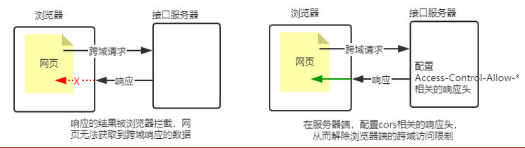

# Node.js

​	Node.js是一个基于Chrome V8引擎的JavaScript运行环境


## fs 文件模块

```js
const fs = require('fs'); 
```

- fs.readFile()方法，用来读取指定文件中的内容

```js
const fs = require('fs'); 
// path表示文件的路径的字符串 
// options表示用什么编码格式读取文件（默认utf8），字符串 
fs.readFile(path[, options], function (err, dataStr){ 
    // err是错误时的参数，如果成功则为null，错误则为一个对象。
    // 可以判断是否为null来知晓文件读取的结果。err.message 一般用来做错误提示消息 
	// dataStr是成功时传回来的参数，是文件的内容
})
```

- fs.writeFile()方法，用来向指定的文件中写入内容

```js
const fs = require('fs'); 
// data表示文件要写入的内容 
fs.writeFile(path, data[, options], function (err){
    // err是错误时的参数
})
```

- 动态拼接路径：在node 命令运行时，代码中的 './' 表示执行 node 命令时的目录，而非该文件所在的目录。所以需要使用`__dirname`表示文件所在的目录的`绝对路径`来进行文件路径的拼接。


## path 路径模块

```js
const path = require('path');
```

- path.join()方法，用来将多个路径片段拼接成一个完整的路径字符串。直接使用+进行字符串的拼接效率低且容易出错。

```js
path.join(__dirname , './file/1.txt') 
// 用这种方法拼接fs模块的相对路径 

path.join('/a', '/b/c', '../', '/d' , 'e')   
// 输出 '/a/b/d/e'  注意../ 表示向上一个目录
```

- path.basename()方法，可以获取路径中的最后一部分，经常通过这个方法获取路径中的文件名

```js
path.basename(path[, ext]) 
// ext 可选参数，填入文件的扩展名可以省去获取文件名时后面的扩展名 
// 如输出的 index.html  和 index 
```

- path.extname() 方法，可以获取路径中的扩展名部分

```js
path.extname(path) // 返回的是扩展名字符串
```


## Http 模块创建服务器

- 搭建基本服务器

~~~js
// 1、导入http模块 
const http = require('http') 
// 2、调用 http.createServer() 方法创建web服务器实例 
const server = http.createServer()； 
// 3、调用服务器实例的on()方法  为服务器实例绑定request事件，监听客户端的请求 
server.on(‘request’，（req，res）=> { 
	// 手动设置响应头，解决中文乱码的问题  
    res.setHeader('Content-Type', 'text/html;charset=utf-8')；
    res.end(`这次是中文了哦`)；
} ) 
	// 只要服务器接收到了客户端的请求，就会调用传进来的回调函数。 
// 3.1 其中req是请求对象  
	// req.url  是客户端请求的URL地址 
	// req.method  是客户端的 method 请求类型 
// 3.2 其中res 是响应对象 
	// res.end()  是向客户端发送指定的内容，并结束这次请求的处理过程 
// 4、调用服务器实例的 .listen()方法来启动当前的服务器实例 
server.listen(端口号，callback)； 
	// callback是启动服务器之后调用，常用来输出提示服务器已启动
~~~


## Express 框架

​	Express 本质就是一个npm上的第三方包，提供了快速创建Web服务器的便捷方法。

- 创建基本的 Web 服务器

~~~js
const express = require('express');
// 创建 web 服务器的实例对象
const app = express();
// 指定端口，创建服务器
app.listen(3000 ,() => {
    console.log('express server running at http://127.0.0.1')
})
~~~

- 监听请求

~~~js
app.get('/user/:id', (req,res) => {
    // 以查询字符串的形式传递的参数，可以被 req.query 以对象的形式存储
    console.log(req.query.name)
    console.log(req.query.age)
    
    // req.params 可以读取动态参数，即 冒号':' 后动态匹配到的参数值。
    // 设置中的冒号后的 URL(id) 为属性名，获得的参数为属性值
    // 如：get请求的URL： '/user/11'
    console.log(req.params.id)  // 11
    
    // 发送的对象是JOSN对象
	res.send({name: 'zs', age: 20})   
	// 发送字符串
	res.send('请求成功')
})

app.post('URL', (req,res) => {
    // 处理函数
})
~~~

- express 路由：express 中的路由就是指**客户端的请求与服务器处理函数的映射关系**

~~~js
// 引入express
const express = require('express');
// 创建Web服务器，命名为app
const app = express();

// 挂载路由
// express 不推荐直接将路由直接挂载在 app 上
app.get('URL', (req,res) => {
    res.send('hello world')
})

// express 更推荐向路由对象中挂载具体的路由
// 调用 express.Router() 方法创建路由对象
const router = express.Router();
// 向路由对象挂载具体的路由
router.get('/user/list', (req,res) => {
    res.send('hello world')
})
// 使用 app.use 方法注册模块。此外，也可以给路由模块的 URL 添加前缀
app.use('/api', router)

// 启动Web服务器
app.listen(80, () => {
    console.log('express server running at http://127.0.0.1')
})
~~~

- express 中间件：本质上是一个function处理函数。注意：在匹配时按中间件定义的先后顺序进行匹配。==且多个中间件之间共享 req、res 对象==，因此中间件之间可以通过这两个对象进行数据的传递
  - 应用级别的中间件（包括全局中间件和局部中间件（即需要匹配的中间件））：通过 `app.use() | app.get() | app.post()等方法`，绑定到app 实例上的中间件。
  - 路由级别的中间件：用法和应用级别的中间件没有区别，只是它绑定到了路由 router 的实例上。
  - 错误级别的中间件：专门用来捕获整个项目中发生的异常错误，从而防止项目异常崩溃的错误中间件
  - express 内置中间件：`express.static | express.json | express.urlencoded`

~~~js
// 全局中间件
app.use('/',(req, res, next) => {
    console.log('全局中间件函数')
    // 进入下一个中间件
    next();
})

// 局部中间件：需要进行匹配。且可以定义多个中间件
app.get('/', (req, res, next) => {
    console.log('局部中间件函数');
	next()
}, (req, res) => {
    console.log('局部中间件函数');
	next()
})

// 路由中间件：用法和应用级别的中间件没有区别，只是它绑定到了路由 router 的实例上。且路由中间件是最后响应给客户端的中间件。
// ...
app.use('/api', router)

// 错误中间件，必须注册在路由器之后
app.use((err, req, res, next) => {
    console.log('发生错误')；
    res.send('Error' + err.message)
})
~~~


内置中间件：

1. express.static ：托管静态资源
   - express指定静态目录，则存放静态文件的目录名(/public)不会出现在URL中
   - 多个静态资源目录，会按照从上到下的顺序查找文件，找到之后就不找了

~~~js
// public为文件名，操作后就可以创建一个静态资源服务器了
app.use(express.static('public'))
app.use(express.static('files'))
// 可以通过给中间件增加前缀的方式给 URL 添加前缀地址。同时也能避免不同目录下文件的重名问题
~~~

2. express.json 与 express.urlencoded
   - express.json 解析JSON格式的请求体数据
   - express.urlencoded 解析URL-encoded格式的请求体数据

~~~js
app.use(express.json())  // 配置了解析JSON数据格式的中间件
app.use(express.urlencoded({extended: false}))

app.get('/user', （req, res) => {
    console.log(req.body)
    // req.body属性接收客户端发送来的请求体数据
    // 如果不配置解析表单数据的中间件，这个属性就为undefined
    // 配置了中间件，如果为数据空或格式不对应，则为{}空对象
})
~~~


第三方中间件：

~~~js
// 1、安装中间件
npm i body-parser
// 2、导入中间件
const body-parser = require('body-parser');
// 3、注册并使用中间件
app.use(body-parser.urlencoded({extended: false}))
~~~


自定义中间件函数示例：

~~~js
functiopn bodyParser(req, res, next) {
    // 1、监听req的data事件
    // 注意：如果数据量比较大，无法一次性发送完毕，则客户端会把数据切割后，分批发送到服务器。所以 data 事件可能会触发多次
    // 每一次触发 data 事件时，获取到数据只是完整数据的一部分，需要手动对接收到的数据进行拼接。
    let str = ``;
    req.on('data', (chunk) => {
        str += chunk;
    };)
    // 2、请求体数据接收完毕之后，会自动触发 req 的 end 事件。
    req.on('end', () => {
        // 拿到完整的请求体数据	
        console.log(str)
        // 3、使用 querystring 模块解析请求体数据
        const qs =  require('querystring')
        // 4、利用 qs.parse()方法，把查询字符串解析成对象，赋值给req.body来供下游使用。
        req.body = qs.parse(str)
        next()
    })
}
~~~


## 使用 Express 框架写基本的接口

### 1. 不跨域的接口

~~~js
const express = require('express');
const app = express();
// 调用路由函数，实例化路由对象。
const apiRouter = express.Router();

// get接口
apiRouter.get('/get', (req, res) => {
    // 1、获取客户端通过查询字符串，发送到服务器的数据
    const query = req.query
    // 2、把数据响应回服务器
    res.send({
        status: 0,
        msg: 'GET请求成功'，
        data: query
    })
})

// post接口
apiRouter.get('/get', (req, res) => {
    // 1、获取客户端通过请求体，发送到服务器的 URL-encoded 数据
    const body = req.body
    // 2、把数据响应回服务器
    res.send({
        status: 0,
        msg: 'POST请求成功'，
        data: body
    })
})
app.use('/api', apiRouter);

app.listen(80, function(){
    console.log('express server runnning at http://127.0.0.1')
})
~~~


### 2. CORS 跨域接口



注意： CORS 只能解决有 XHR level2 的浏览器。

使用 CORS 中间件：

~~~cmd
# 首先安装 cors 包
npm install cors
~~~

~~~js
// 导入并使用中间件
const cors = require('cors')
app.use(cors())
~~~

配置 CORS 响应头：

~~~js
// 1. Access-Control-Allow-Origin 指定了允许访问该资源的外域 URL
// 例如：下面字段表示只允许来自百度的请求
res.setHeader('Access-Control-Allow-Origin', 'http://www.baidu.com')
// 下面的字段表示允许来自任何域的请求。*为通配符
res.setHeader('Access-Control-Allow-Origin', '*')

// 2. 如果请求设置了非简单请求的请求头，则需要设置 Access-Control-Allow-Headers 响应头进行声明
// 允许客户端额外向服务器发送 Content-Type 和 X-Custom-Header 请求头
res.setHeader('Access-Control-Allow-Headers', 'Content-Type, X-Custom-Header')

// 3. 如果请求发起了非简单请求的 HTTP 请求方法，则需要配置 Access-Control-Alow-Methods 指明允许使用的 HTTP 方法
// 只允许 POST、GET、HEAD、DELETE 请求方法
res.setHeader('Access-Control-Alow-Methods', 'POST, GET, HEAD, DELETE')
// 允许所有的HTTP方法
res.setHeader('Access-Control-Alow-Methods', '*')
~~~

满足以下所有条件的请求即是上面提到的==简单请求==：

1. HTTP 请求方式的要求：GET、POST、HEAD 三者之一
2. HTTP 请求头的要求：
   - 无自定义头部字段
   - Accept
   - Accept-Language
   - Content-Language
   - DPR
   - Downlink
   - Save-Data
   - Viewport-Width
   - Width 
   - Content-Type（只有三个值application/x-www-form-urlencoded、multipart/form-data、text/plain）

​	反之则是复杂请求。进行复杂请求的时候，浏览器会在与服务器正式通信前发送一次 OPTION 预检请求进行预检，在服务器响应预检请求之后，才会发送真正的请求。即复杂请求会向服务器发送两次请求。


### 3. JSONP 请求

​	如果项目中已经配置了 CORS 跨域资源共享，为了防止冲突，**必须在配置 CORS 中间件之前声明 JSONP 的接口**。否则 JSONP 接口会被处理成开启了CORS的GET接口。

~~~js
// JSONP 请求是 GET 请求
app.get('/api/jsonp', (req, res) => {
    // 1. 通过查询字符串获取到回调函数名
    const funcName = req.query.callback;
    // 2. 这是需要相应回去的数据
    const data = {name: 'zs', age: 22};
    // 3. 将数据作为回调函数的参数，相应给客户端一个函数调用的字符串
    const scriptStr = `${funcName}(${JSON.stringify(data)})`
    res.send(scriptStr)
})
~~~


## Express 实现身份认证

### 1. Session 认证

首先安装 `Session`中间件。`npm i express-session`

~~~js
// 导入并配置session中间件
var session = require('express-session')
app.use(
    session({
    	secret: '任意字符串' // 用于加密
    	resave: false,
    	saveUninitialized: true // 固定写法
}))
~~~

配置完成后，我们可以通过 req.session 来访问和使用 session 对象，从而存储用户信息。

~~~js
app.post('/api/login', (req, res) => {
    // 判断用户提交的信息是否正确
    if(req.body.username !== 'admin' || req.body.password !== '000000'){
        return res.send({status: 1, msg:'登录失败'})
    }
    
    // 将用户的信息，存储到 Session 中
    req.session.user = res.body 
    // 将用户的登录状态存储到Session中
    req.session.islogin = true
    res.send({status: 0, msg:'登录成功'})
})


// 从Session中取数据
app.get('/api/username', (req, res) => {
    // 判断用户是否登录
    if (!req.session.islogin){
        return res.send({status: 1, msg: 'fail'})
    }
    res.send({
        status: 0, 
        msg: 'success', 
        username = req.session.user.username
    })
})

// 清空Session
app.post('/api/loginout', (req, res) => {
    // 清空当前客户端对应的 Session信息
    req.session.destory()
    res.send({status: 0, msg: 'success'})
})
~~~

- 服务器设置了req.session 的属性 不仅是在服务器里存储了信息，也自动发送了cookie给客户端。
- 然后客户端再请求时,req.session拿到的不是服务器存储的信息，是客户端的cookie
- 退出登录的时候destory，不仅清除了服务器的数据，也清除了客户端的数据。就能防止客户端再次拿这个以前的cookie登录


### 2. JWT 认证

~~~cmd
# 安装JWT的包
npm i jsonwebtoken express-jwt
# jsonwebtoken 用于生成JWT字符串
# express-jwt 用于将JWT字符串解析还原成JSON对象
~~~

~~~js
// 导入并配置 JWT 的包
const jwt = require('jsonwebtoken')
const expressJWT = require('express-jwt')

// 定义 secret 密钥，用于生成和解析JWT字符串
const secretKey = 'hello world'

// 登录成功后生成JWT字符串
app.post('/api/login', function(req, res){
    // ... 登录失败的代码
    // 登录成功后，生成并通过 token 属性给客户端响应 token 字符串
    res.send({
        status: 200,
        message: '登录成功！',
        token: jwt.sign({ username: user.username}, secretKey, { expiresIn: '30s'})
    })
})


// 将jwt字符串还原成 JSON对象
// 客户端每次在访问那些有权限接口的时候，都需要主动通过请求头中的 Authorization 字段将 Token 字符串发送到服务器进行身份认证
// 服务器可以通过 express-jwt 这个中间件，自动将客户端发送过来的 Token 解析还原成 JSON 对象
// unless 表示 以api开头的接口都不需要访问权限，里面的正则可以随意替换，[]是固定写法
app.use(expressJWT({ secret: secretKey }).unless({ path: [/^\/api\//] }))

// 当中间件express-jwt 配置成功后，即可在有权限的接口中，使用req.user对象来访问从JWT字符串解析出来的用户信息了
app.get('/admin/getinfo',function(req, res){
    console.log(req.user)
    res.send({
        status: 200,
        message: '获取用户信息成功',
        data: req.user
    })
})

// 如果客户端发来的Token字符串过期或者不合法，会产生解析失败的错误，我们可以用错误中间件进行捕获
app.use((err, req, res, next) => {
    // token解析失败导致的错误
    if(err.name === 'UnauthorizedError') return res.send({status: 401, message: '无效的token'})
    
    // 后面是其他错误的响应代码
})
~~~

- JWT认证中如果没有退出登录就destory 这一步，因为我们设置了时间限制的。