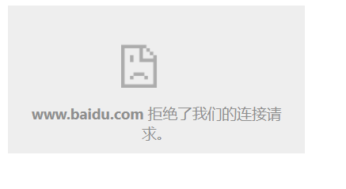
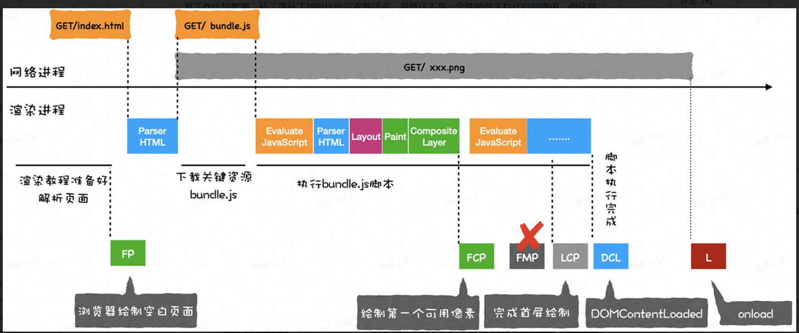
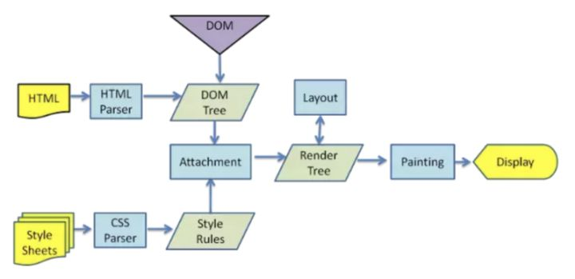
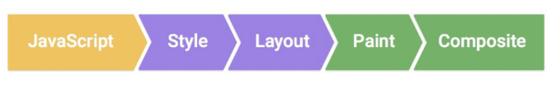
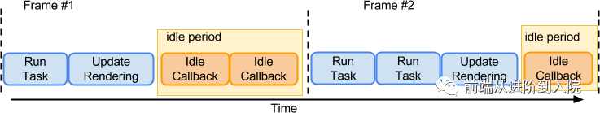
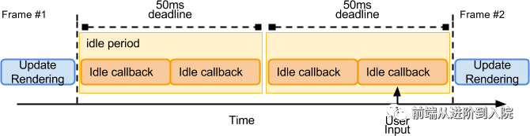
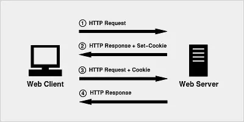

#  浏览器的多进程架构

进程：是程序执行分配和管理资源的单位，操作系统会为进程分配内存。两个进程之间可以通过 IPC 通信。

线程：线程是 cpu 调度的基本单位，一个进程可能有多个线程。

Chorme 采用的是多进程的架构，优点是进程之间不会相互影响，安全稳定。缺点不同进程常常会有同样的内容而无法复用。

- 顶层存在一个 Browser process 用以协调其他进程
  - 地址、书签栏、url 前进后退
  - 网络请求、文件访问
- Renderer process 
  - 负责一个 tab 内网页的渲染
- Plugin process
  - 控制网页的插件
- GPU process
  - 处理 GPU 相关任务


## 导航过程

地址栏搜索网站：浏览器进程UI线程

开始导航：浏览器网络线程

读取响应：如果响应的 Content-type 显示是 HTML文件，会将它通过 IPC 交给渲染进程渲染。

提交导航：渲染进程收到数据后会通知浏览器进程，浏览器进程更新 UI、历史记录等。

渲染完成：向浏览器进程发送消息，导航结束。


# 跨域与安全防范

## 同源策略

浏览器中，同源策略分为：

1. DOM 同源策略（同步的同源策略）阻止不同源页面之间对 DOM 进行操作。
   - 主要场景是 iframe 标签。无法在不同源的主页面中对 iframe 标签内的DOM进行操作。
   - 没有这种同源策略的结果是会造成==点击劫持==



2. XHR 同源策略（异步的同源策略）
   - 阻止不同源的网站的 XHR 对象发起 ajax 请求。
   - 没有该同源策略的结果是会造成 ==CSRF攻击==


在 html 标签中，允许跨域加载资源的方式：

1. ``
2. `<link href="xxx">`
3. `<script src="xxx">`
4. 直接提交表单触发的 post 请求


## jsonp 

​	JSONP 的原理很简单，就是利用 `<script>` 标签没有跨域限制的漏洞。通过 `<script>` 标签指向一个需要访问的地址并提供一个回调函数，通过回调函数的参数来接收数据。但是缺点是只支持get请求。

​	使用jsonp：

1. 在发起请求之前先在一个 script 标签中定义一个回调函数，这个回调函数接受一个参数。
2. 创建另一个 script 标签，通过 src 发起请求，并将先前定义的回调函数以查询字符串的形式传递给这个URL。服务器会收到这个函数体，将响应回的数据填充在该回调函数的第一个参数中，再将这个函数调用返回给该请求的 script 标签，js 引擎就会自动在浏览器调用。


## CORS

CORS 需要浏览器和服务器同时支持。但是整个 CORS 通信过程，都是浏览器自动完成，用户无感。


浏览器一旦发现 AJAX 请求跨源，就会==自动添加一些附加的头信息==

- 在简单请求中添加` Origin`头
- 复杂请求中添加，有时还会多出一次附加的 ==OPTIONS 预检请求==。

且如果需要发送 cookie， 浏览器需要将 XHR 对象的`withCredentials`属性设置为 true；同时，`Cookie`依然遵循同源政策，只有用服务器域名设置的`Cookie`才会上传，其他域名的`Cookie`并不会上传，且（跨源）原网页代码中的`document.cookie`也无法读取服务器域名下的`Cookie`。


服务端在响应头中设置 `Access-Control`类的头就可以开启 CORS。 

- `Access-Control-Allow-Origin` 字段是必须的，表示接受某域名的请求
- `Access-Control-Allow-Credentials`表示是否允许发送 cookie （默认为 true）
- `Access-Control-Expose-Headers` 该字段可选。`CORS`请求时，`XMLHttpRequest`对象的`getResponseHeader()`方法只能拿到6个基本字段：`Cache-Control`、`Content-Language`、`Content-Type`、`Expires`、`Last-Modified`、`Pragma`。如果想拿到其他字段，就必须在`Access-Control-Expose`中指定

​	值得注意的是，如果响应头没有该字段或者字段内容不符合，会在 xhr 对象里抛出一个错误，且由于服务器是正常响应的，因此无法根据响应的状态码判断。


### 简单请求

以 Ajax 为例，当满足以下条件时，会触发简单请求

1. 使用下列方法之一：
   - GET
   - HEAD
   - POST

2. Content-Type 首部的值仅限于下列三者之一：
   - text/plain  （text）
   - multipart/form-data  （form-data）
   - application/x-www-form-urlencoded  （url-encoded）

3. 请求中的任意 `XMLHttpRequestUpload` 对象均没有注册任何事件监听器； `XMLHttpRequestUpload` 对象可以使用 `XMLHttpRequest.upload` 属性访问。


### 复杂请求

​	那么很显然，不符合以上条件的请求就肯定是复杂请求了。

​	在浏览器与服务器正式通信之前，浏览器会先发送 OPTION 请求进行预检，以获知服务器是否允许该实际请求。

​	所以这一次的 OPTION 请求称为**“预检请求”**。服务器成功响应预检请求后，才会发送真正的请求，并且携带真实数据。


### 服务器代理

浏览器有同源策略，但是服务器没有，所以可以由服务器请求跨域资源然后返回客户端。


## XSS 攻击 (代码注入到网页中)

**XSS 简单点来说，就是攻击者将可以执行的客户端代码注入到网页中。**可以分为反射型 和 非持久型。

反射型发生在传递给服务器的数据被立即在浏览器中执行时。

如攻击者可以在 url qurey 参数的值中写入脚本，发送给另一个用户，则该用户点开时就会受到攻击，执行这段代码时就可以获取身份认证之类的信息。


持久型是服务器将恶意脚本存储在了站点中，在用户访问时就可以执行。

比如 html 格式的评论，如果没有防御措施，在评论中写入脚本，则会导致每个用户在该评论加载完成时受到攻击，这段代码可能就会向攻击者发送用户信息。


### 防范方式

#### 转义字符

对于用户的输入应该是永远不信任的。最普遍的做法就是转义输入输出的内容，对于引号、尖括号、斜杠进行转义

```js
function escape(str) {
  str = str.replace(/&/g, '&amp;')
  str = str.replace(/</g, '&lt;')
  str = str.replace(/>/g, '&gt;')
  str = str.replace(/"/g, '&quto;')
  str = str.replace(/'/g, '&#39;')
  str = str.replace(/`/g, '&#96;')
  str = str.replace(/\//g, '&#x2F;')
  return str
}
```


#### 建立白名单（CSP）

CSP 本质上就是建立白名单，开发者通过 http 响应头明确告诉浏览器哪些外部资源可以加载和执行，如何拦截是由浏览器自己实现的。

- 设置 HTTP 响应头的 `Content-Security-Policy `
- 设置 meta 标签的方式 `<meta http-equiv="Content-Security-Policy">`


## CSRF攻击 （跨站请求伪造）

​	CSRF 中文名为`跨站请求伪造`。简单来说就是==利用了用户存储在浏览器中的登录状态发起攻击==；

举例：

John是一个恶意用户，他知道某个网站允许==已登陆==用户使用包含了账户名和数额的HTTP `POST`请求来转帐给指定的账户。John 构造了包含他的银行卡信息和某个数额做为隐藏表单项的表单，然后通过Email发送给了其它的站点用户（还有一个伪装成到 “快速致富”网站的链接的提交按钮）.

 如果某个用户点击了提交按钮，一个 HTTP `POST` 请求就会发送给服务器，该请求中包含了交易信息以及浏览器中与该站点关联的所有客户端cookie（将相关联的站点cookie信息附加发送是正常的浏览器行为) 。服务器会检查这些cookie，以判断对应的用户是否已登陆且有权限进行上述交易。

最终的结果就是任何已登陆到站点的用户在点击了提交按钮后都会进行这个交易。John发财啦！

​	

​	注意：即使有同源策略，但是 ajax 请求依旧被正常发出并响应，只不过浏览器会拦截响应罢了。（因此仅仅依靠同源策略并不能完全阻止 CSRF 攻击，携带用户信息的 ajax 请求依然会被发送出去）


### 防范方式

#### cookie 的 SameSite

可以对 Cookie 配置 `SameSite` 属性。使得 ==Cookie 不随着跨域请求发送==，可以很大程度减少 CSRF 的攻击，但是该属性目前并不是所有浏览器都兼容。


#### 后端主动验证是否同源

对于需要防范 CSRF 的请求，我们可以通过验证请求头的 `Origin Header `和 ` Referer Header`  来判断该请求是否为第三方网站发起的。这两个Header在浏览器发起请求时，大多数情况会自动带上，并且不能由前端自定义内容。


#### Token字符串

每次页面加载时，使用 JS 遍历整个DOM树，对于DOM中所有的 a 和 form 标签后加入Token，使得这个页面中的每一个 Form 及 Ajax请求都携带这个Token，这个 token 是会话级别的，时效短。但是相对比较繁琐，需要每一个页面和接口都添加对应的输出和校验，安全性高。


## 点击劫持 （iframe）

点击劫持是一种视觉欺骗的攻击手段。攻击者将需要攻击的网站通过 `iframe` 嵌套的方式嵌入自己的网页中，并将 `iframe` 设置为透明，在页面中透出一个按钮诱导用户点击。


### 防范方式

#### 不允许使用 iframe 访问

`X-FRAME-OPTIONS` 是一个 HTTP 响应头，是为了防御用 `iframe` 嵌套的点击劫持攻击。

该响应头有三个值可选，分别是

- DENY，表示页面不允许通过 iframe 的方式展示。
- SAMEORIGIN，表示页面可以在相同域名下通过 iframe 的方式展示。
- ALLOW-FROM，表示页面可以在指定来源的 iframe 中展示。

简单来说，就是在后端配置不允许或允许指定的域名中使用 iframe 标签，然后通过这个响应头使得浏览器不展示。

或者可以通过一些 JS 代码，当通过 iframe 的方式加载页面时，iframe 标签直接不显示所有内容。


## 中间人攻击 （https 已经很好的解决）

​	中间人攻击是==攻击方同时与服务端和客户端建立起了连接==，并让对方认为连接是安全的，但是实际上整个通信过程都被攻击者控制了。攻击者不仅能获得双方的通信信息，还能修改通信信息。

​	通常来说不建议使用公共的 Wi-Fi，因为很可能就会发生中间人攻击的情况。

​	HTTPS 就可以用来防御中间人攻击，但是并不是说使用了 HTTPS 就可以高枕无忧了，因为如果你没有完全关闭 HTTP 访问的话，攻击方可以通过某些方式将 HTTPS 降级为 HTTP 从而实现中间人攻击。


## SYN 泛洪攻击 （不进行第三次握手）

​	攻击者使用欺骗性IP地址向目标服务器发送大量SYN数据包。然后，服务器响应每个连接请求，并准备好接收响应的开放端口。当服务器等待时，攻击者继续发送更多的SYN数据包。每个新SYN数据包的到达导致服务器暂时维持新的开放端口连接一段时间，并且一旦利用了所有可用端口，服务器就无法正常运行。


### 防范方式

SYN cookie：

​	在服务器收到SYN请求报文段后，服务器不会为此 SYN 创建半开连接，而是生成一个序列号（SYN cookie），此时服务器不会为这个请求分配任何的资源。在客户端返回 ACK 请求报文之后，服务器会验证这个cookie ，只有验证成功才会建立 TCP 连接，分配资源。此外这个 cookie 也常用作优化 TCP 三次握手连接的手段。


## DDOS 攻击 （大量 TCP 连接）

一般来说是指攻击者利用“肉鸡”对目标网站在较短的时间内发起大量请求，大规模消耗目标网站的主机资源，让它无法正常服务。

### 防范方式

1. 黑名单
2. 及时关闭异常连接
3. CDN 加速


# 浏览器缓存机制

## 缓存位置

从缓存位置上来说分为四种，根据优先级从高到低：

1. Service Workers
   - Service Worker 是运行在浏览器背后的**独立线程**，一般可以用来实现缓存功能。
   - 传输协议必须为 HTTPS，因为涉及到拦截请求
   - 缓存步骤：
     1. 注册 Service Worker
     2. 监听到 `install` 事件以后就可以缓存需要的文件，那么在下次用户访问的时候就可以通过==拦截请求==的方式查询是否存在缓存，存在缓存的话就可以直接读取缓存文件，否则就去请求数据
   - server 可以让我们自由控制缓存内容、如何匹配，且缓存不会被自动清除。
   - 如果没有在 Service Worker 命中缓存的话，会根据缓存查找优先级去查找数据，但是无论是从其他缓存中找到数据，还是网络请求找到数据，浏览器都会显示是从 Server Worker 中获取的内容。

2. Memory Cache（内存缓存）
   - 内存缓存不受 max-age / no-cache 配置的影响，即使不设置缓存，一些资源也会被缓存下来，但是关闭浏览器就会被清除。
   - 配置 no-store 可以让内存缓存也被禁止
   - 内存缓存相对高效，但是受限于内存大小，容量较小。因此会缓存一些使用率高的文件。

3. Disk Cache （硬盘缓存）
   - 相较于内存缓存，时效高，内存大。
   - 一般浏览器缓存大概率是硬盘缓存
   - **prefetch cache(预取缓存)**也属于硬盘缓存，他是通过 link 标签进行预加载（prefetch）的缓存，在浏览器空闲时加载

4. Push Cache
   - 配合 http2 进行的。
   - 可以推送被指定了 no-store 和 no-cache 的资源，相当于是服务器主动推送（预判了你的请求）。
   - Push Cache 缓存的资源只能被使用一次。并且浏览器器可以拒绝。
   - 只在会话中存在，一旦连接被关闭了，这个缓存就会被清除。

5. 网络请求


## 缓存策略

浏览器缓存策略分为两种：强缓存和协商缓存，并且缓存策略都是通过==设置 HTTP Header== 来实现的。

- 强缓存：强缓存中，当请求再次发出时，浏览器直接从缓存中获取资源，而不会与服务器发生通信，状态码为200
  - 强缓存的 http 头为 `Expires` （一个具体时间之前，根据的是本地时间，不准确，在 http1.0 中用于缓存）和 `Cache-Control`（这次响应的多少秒之后，相对时间，在http 1.1 中被用于缓存）；两者同时存在时，Cache-Control 的优先级更高
  - `Cache-Control:max-age=300`表示使用强缓存，在指定时间（300 秒）内再次加载资源，就会命中强缓存。
  - `Cache-Control:no-cache`表示使用 Etag 或者 Last-Modified字段来控制缓存（协商缓存）
  - `Cache-Control:no-store`表示所有内容既不会被协商缓存，也不会被强缓存。
  - 一般使用的都是`Cache-Control`，因为其 `max-age `是相对时间，不受服务端 / 客户端时间不对的影响。
- 协商缓存：使用缓存前，都会向服务端发起  http 请求，如果缓存资源未改动，返回状态码为304 （Not Modified），重定向到浏览器缓存，并且==更新缓存时间==。如果资源有更新，服务端返回状态码 200、新的 Last-Modified 或 Etag 和正文。协商缓存并不会节省连接数，但是没有正文，因此可以提高速度。
  - http 头为`Last-Modified `或者 `ETag`
  - 服务器响应的`Last-Modified` 响应头中返回文件最后一次更改时间，而下一次浏览器发起请求时，会将该时间放到 http 头里的 `If-Modified-Since`。服务器在接收到后也会做比对，如果在这个事件后进行了修改，则会正常进行响应。缺点是只能精确到秒，1 秒内的多次变化反映不出来。
  - 服务器响应的`Etag `响应头是当前资源文件的一个唯一标识，只要资源有变化，Etag就会重新生成。而浏览器在下一次发起请求时会通过 http 请求头中的 `If-None-Match`头中。服务器会进行判断。
- HTML文件千万别设置强缓存，目前开发页面，大多数情况下都是单页面应用，一旦html不能成功更新，那将是灾难级的技术故障，所以html应该设置 Cache-Control 为 no-cache，每次请求都去和服务器的文件比对。
- 关于浏览器的刷新：
  - 普通刷新会继续使用协商缓存，忽略强缓存；
  - 强刷会忽略浏览器所有缓存（并且请求头会携带 Cache-Control:no-cache 和 Pragma:no-cache，用来通知所有中间节点忽略缓存）


# 浏览器渲染原理

 浏览器内核主要分成两部分：渲染引擎和 JS 引擎。

   渲染引擎的职责就是渲染，即在浏览器窗口中显示所显示的内容。

   JS 引擎解析和执行 javascript 来实现网页的动态效果。


## 渲染过程

1. 首先解析收到的文档，定义构建一棵 DOM 树。
   - 当浏览器遇到`script`标签时，==DOM构建将暂停==，直至脚本执行完成。

     - 普通 script 标签：**占用主线程**下载（下载会阻塞文档解析）（但是可以同时下载多个 js 文件），并按顺序同步执行（执行也占用主线程）。执行完 js 文件之后触发 `DOMContentLoaded`

       

     - async 属性：下载完 js 文件就立即执行（下载不会占用主线程，但是执行仍然会占用主线程），不管 script 标签的顺序与 DOM解析。执行 js 文件与否 与 `DOMContentLoaded`事件无关。

       

     - defer 属性：下载完 js 文件，延迟到 DOM 加载完毕后按顺序执行（不是页面全部元素）（下载不会占用主线程，但是执行仍然会占用主线程）。执行完 js 文件之后触发 `DOMContentLoaded`。

       

2. CSS 文件转换为 CSSOM 树
   - 通常 CSSOM 树和 DOM 树是并行构建的。CSS加载不会阻塞 DOM 解析
   - 但是 JS 脚本执行时可能会请求样式信息，因此浏览器需要执行脚本时会先下载和构建完 CSSOM，然后再执行 JavaScript，最后继续解析文档
   - 在构建 CSSOM 树的过程中，浏览器会不断递归 CSSOM 树，以确定每一个节点的样式到底是什么，因为一个节点的样式不光是直接设置，也可以继承。
   - 综上所述我们应该尽可能的`避免写嵌套过深的 CSS 选择器`，然后对于 DOM树 来说也`尽量少的添加无意义标签`，==保证层级扁平==。
   
3. 生成DOM和 CSSOM 树后，将两棵树组合为布局树
   - 因此，如果 DOM 和 CSSOM 任何一方加载过慢，就只能等待。
   - 在一些浏览器中（火狐），解析引擎的机制是 CSS 未加载前先展示html。此时如果 CSSOM 加载的慢（文件过大或 link 标签放在了底部），就会出现无样式，然后突然呈现样式的情况。
   - 在另一些浏览器中（Chorme， IE），需要先构建完 DOM 树和 CSSOM 树，才会继续进行渲染，如果 DOM 树构建的慢（如 js 文件被放到了顶部）或 CSSOM 树构建的慢，会导致浏览器迟迟不渲染，出现白屏。
   
4. 生成布局树后，会对特定的节点进行分层，构建一颗图层树，每一个图层也称为合成层，生成合成层的方式有：

   1. 显示合成：
      - 根元素  html（节点的图层会默认属于根节点的图层）
      - z- index
      - transform 
      - filter
      - will-change 指定的属性为上面任意一个
      - 3D 或透视变换(perspective transform) CSS 属性
      - `video`、`iframe` 标签。
   2. 隐式合成：
      - 某些节点被提升为单独的图层后，另外某些与之有关系的节点都会被提升为一个单独的图层，这样的后果可能是增加成千上万个图层，让页面崩溃。解决办法一般是为要提升的节点增加 z-index 属性。

5. 渲染引擎将每个图层的绘制交给专门的==合成线程==完成，合成线程操作完毕后发送绘制命令给浏览器进程。浏览器生成页面，并显示。







### 操作 DOM 慢，那么往页面中插入几万个 DOM ，如何实现不卡顿？

操作大量 DOM 的优化，主要是从避免造成大量回流的角度考虑：

- 从浏览器事件循环的角度说：可以使用 HTML5 新增加的 API `window.requestAnimationFrame() `函数，分批次的异步的部分插入并渲染 DOM。

  - 异步更新 DOM 可以避免多次重复渲染，因为如果是同步更新，可能会在更新过程中触发多次渲染；而异步更新因为会被包装成微任务，在浏览器事件循环中一次渲染，减少重绘和回流。
  - Vue 的状态更新手法：利用 nextTick。Vue 的异步任务默认情况下都是用 Promise 来包装成微任务的。这个不细讲。

- 从一次性插入的角度说：

  - 可以先 `document.createElement（'div'）`创建一个 div 元素，然后创建需要的大量 DOM 元素，循环 `appendChild()`将 DOM 元素插入到 div 中。然后再将 div 插入页面。这样可以达到一次性插入，避免多次回流的目的，但是多了一个无用的 div 标签。
  - 使用`createDocumentFragment`在内存中创建文档片段，他与上述创建 div 方法的区别是它被插入到页面中的元素是他的子孙元素，可以避免上述方法的冗余标签。

  ~~~js
  var ul = document.getElementById('ul');
  var f = document.createDocumentFragment();
  for(var i = 0;i<10;i++) {
      var li = document.createElement('li');
      f.appendChild(li);
  }
  ul.appendChild(f);
  ~~~

  

### window.onload 和 DOMContentLoaded

DOMContentLoaded 在 **html文档加载完毕，并且 html 所引用的内联 js、以及外链 js 的==同步代码==都执行完毕后触发**，无需等待样式表、图像和子框架的完成加载，而window.onload 会等待全部响应完后再触发。


## 重绘 回流

- 重绘（repaint）是当节点需要`更改外观而不会影响布局`的，相较于上面的渲染主进程，只需要重新计算样式并绘制即可。


- 回流（layout）是`布局或者几何属性需要改变`就称为回流。回流必定发生重绘。回流所需要的成本也比重绘高得多，上面的渲染主进程会重新进行一遍。



- 此外，还有一种更新界面的方式：直接合成。如利用 CSS3 的`transform`、`opacity`、`filter`这些属性就可以实现直接合成的效果，也就是大家常说的**GPU加速**，他们会直接进入合成线程的处理，因而不会触发重绘和回流。


以下几个动作可能会导致回流：

- 一个 DOM 元素的几何属性变化，常见的几何属性有`width`、`height`、`padding`、`margin`、`left`、`top`、`border` 等等。
- 使 DOM 节点发生`增减`或者`移动`。
- 读写 `offset`族、`scroll`族和`client`族属性的时候，浏览器为了获取这些值，需要进行回流操作。
- 调用 `window.getComputedStyle` 方法。


### 减少重绘和回流：

- 使用 transform 替代 top，使用 transform 和 opacity 不会触发重绘和回流
- 使用 opacity  、 visibility 替换 display: none ，因为后者会引发回流（改变了布局）。
- 不要频繁读写 `offset`族、`scroll`族和`client`族属性
- 动画可以选择使用 `requestAnimationFrame`
- 将频繁触发重绘和回流的节点设置为图层


## 浏览器事件循环

​	浏览器让执行异步 JavaScript 和 更新用户界面（重绘和回流）共用同一个单线程，这个线程的工作基于消息队列，在进程空闲时执行这个队列的任务，该任务要么是 UI 更新，要么是执行 JS 代码。

​	当 Eventloop 执行完一个宏任务并清空微任务后，会进行判断，两种情况都满足浏览器会跳过屏幕渲染步骤：

- 浏览器判断更新渲染不会带来视觉上的改变。
- 帧动画回调为空（可以通过 `requestAnimationFrame` 来请求帧动画。）

如果不满足跳过的条件，就会进行以下的屏幕渲染步骤：

1. 判断是否有 `resize` 或者 `scroll` 事件，有的话会去触发事件

2. 判断是否触发了 媒体查询，有就进行响应的样式修改。

3. 更新动画并且触发事件。

4. 判断是否有全屏操作事件。

5. 执行 `requestAnimationFrame` 回调。

6. 执行 `IntersectionObserver` 回调，该方法用于判断元素是否可见，可以用于懒加载上，但是兼容性不好。

7. 执行==上面的渲染操作来更新界面==。（重绘和回流）

8. 如果在一帧中有空闲时间（ `task队列`和`microTask`都为空），就会去执行 `requestIdleCallback` 回调（浏览器空闲）。

   浏览器是 60Hz 的刷新率，每 16.6ms 才会更新一次（不同设备或不同浏览器可能有所不同），因此事件循环的执行的函数==自带16.6ms的节流功能==。

   

注意：

- UI 渲染和交互的处理是通过 ==宏任务== 来调度的，因此耗时的同步任务和微任务会导致渲染和交互任务得不到调用（但宏任务不会卡住 UI 渲染），也就是页面“卡死”。浏览器每 16ms 需要一次渲染。 如果存在一个任务在 16ms 内未能执行结束，页面交互就会掉帧给人卡顿的感觉。
- 如果页面性能无法维持 60fps（每 16.66ms 渲染一次）的话，那么浏览器就会选择 30fps 的更新速率，而不是偶尔丢帧。
- 常规的理解来说，宏任务之间理应穿插一次渲染，但是浏览器会尽量将两个宏任务合并在一次渲染中，也因此造成了 setTimeout 的不稳定性。


HTML5 中的 `requestAnimationFrame`回调函数：

- 是官方推荐的用来做一些流畅动画所应该使用的 API
- 这个函数告诉浏览器，在下一次重绘前调用传入的回调函数，然后在这个函数中再次调用 `window.requestAnimationFrame()` 实现更新动画。这个回调函数的第一个参数，表示当前函数被触发的时刻的时间，单位是 ms。
- 使用这个函数与 setTimeout 的区别：
  - 掉帧问题：
    - 在 JavaScript 中， `setTimeout`指定的时间只是将这个回调函数加入到消息队列的时间，只有当主线程上的任务执行完以后，才会去检查该队列的任务是否需要开始执行。所以，**setTimeout的实际执行时间一般比其设定的时间晚一些**。
    - 不同设备的屏幕刷新率可能不同，`setTimeout`只能设置固定的时间间隔，这个时间和屏幕刷新间隔可能不同，积累下来会有一部分 使用 `setTimeout / setInterval`定义的上一个动画没有被展示到屏幕上而被下一个动画覆盖，造成丢帧现象。
    - 使用 `requestAnimationFrame` 执行动画，最大优势是**能保证回调函数在屏幕每一次刷新间隔中只被执行一次**，这样就不会引起丢帧，动画也就不会卡顿，此外还==自带节流效果==
  - 节省资源问题：
    - 使用 `setTimeout` 实现的动画，当页面被隐藏或最小化时，定时器`setTimeout`仍在后台执行动画任务，浪费资源
    - 使用`requestAnimationFrame`，当页面处于未激活的状态下，该页面的屏幕刷新任务会被系统暂停，因此也会暂停`requestAnimationFrame`。节约资源

例如，我们希望浏览器页面闪现一帧红色：

方式一：这样显然无法实现目的，因为两句代码中没有插入渲染任务。

~~~js
document.body.style.background = 'red';
document.body.style.background = 'white';
~~~

方式二：利用 setTimeout 将两个代码在不同的任务中执行，但是由于 setTimeout 和 渲染任务没有联系，因此无法确定渲染任务是否刚好插在两个代码之间，因此只能有几率实现。

~~~js
document.body.style.background = 'red'; 
setTimeout(function () { 
    document.body.style.background = 'white'; 
}， 0)
~~~

方式三：使用 requestAnimationFrame ,  插入的任务会在每次渲染任务 **之前** 执行

~~~js
requestAnimationFrame(() => { 
        document.body.style.background = 'red'; 
        requestAnimationFrame(() => {
                document.body.style.background = 'white';
        }) 
})
~~~


`requestIdleCallback` 回调函数：

- 是浏览器提供给我们的空闲调度算法，在渲染屏幕之后执行，理想状态如下图：

  1. 有序进行渲染，期间有空闲

     

  2. 渲染长期空闲（注意，仍然有 50ms 的 deadline，防止长期卡住浏览器进程）

     

- 但是需要注意，任务需要被切分成小片，不然会阻塞浏览器渲染。
- `requestIdleCallback`有空执行要看浏览器的调度，如果你一定要它在某个时间内执行，请使用 `timeout`参数。

~~~js
window.requestIdleCallback(callback[, options])
// callback: 函数的第一个参数 获取当前空闲时间以及回调是否在超时时间前已经执行的状态
// options: timeout 调在timeout毫秒过后还没有被调用，那么回调任务将放入事件循环中排队，即使这样做有可能对性能产生负面影响
~~~


# 浏览器本地存储

浏览器的本地存储主要分为`Cookie`、`WebStorage`和`IndexedDB`, 其中`WebStorage`又可以分为`localStorage`和`sessionStorage`。

| 特性         | cookie                      | localStorage                                     | sessionStorage                                     | IndexedDB                                      |
| :----------- | :-------------------------- | :----------------------------------------------- | :------------------------------------------------- | ---------------------------------------------- |
| 数据生命周期 | 生存时间由 expires 属性指定 | 除非被主动清理，否则一直存在                     | 会话级的存储，页面关闭就清理                       | 运行在浏览器当中的非关系型数据库，不会自动删除 |
| 数据存储大小 | 4K                          | 5M                                               | 5M                                                 | 无限                                           |
| 与服务端通信 | http 请求时会自动发送       | 不参与                                           | 不参与                                             | 不参与                                         |
| 用途         |                             | 存储一些内容稳定的资源，如 Base64 格式的图片资源 | 存储表单信息，页面刷新也不会让之前的表单信息丢失。 | 大型数据的存储                                 |
| 同源性       | 一个域名对应一个cookie      | 一个域名对应一个localStorage                     | 一个域名对应一个sessionStorage                     | 一个域名对应一个数据库，无法访问跨域的数据库   |

- 同源：每一个同源的网页存储对应的 cookie / localStorage / sessionStorage
- 存储形式：他们都是字符串类型的键值对
- 大小：4k 与 5M
- 有效时间：


## cookie

cookie 设计出来的最初目的，是用于弥补浏览器无状态性的缺点的，内部以键值对的方式来存储信息。

向一个域名下发起请求，都会自动携带浏览器在该域名下存储的 cookie 。



cookie 缺陷：

1. 容量小，4KB
2. 自动发送，性能差
3. 安全性差。

| 属性      | 作用                                                         |
| --------- | ------------------------------------------------------------ |
| value     | 如果用于保存用户登录态，应该将该值加密，不能使用明文的用户标识 |
| http-only | （true / false）指定 Cookie 是否可通过客户端脚本访问，避免 XSS 攻击获取用户 cookie 的可能 |
| secure    | 只能在协议为 HTTPS 的请求中携带                              |
| same-site | （Strict / Lax / None）规定浏览器不能在跨域请求中携带 Cookie，减少 CSRF 攻击 |


## 跨域 cookie 共享

要点：

1. 服务端负责在响应中携带 Access-Control-Allow-Credentials 头，在跨域请求的响应中允许Set-Cookie响应头；
2. 浏览器端设置异步对象 （xhr）的 withCredentials 属性，它使得浏览器保留下响应的跨域 Cookie 等信息，并且下次发送请求时将其携带。


###  Samesite 属性

​	浏览器的 Cookie `SameSite`属性，主要用于防止 CSRF攻击 和 用户追踪。

~~~js
响应头： Set-Cookie: CookieName=CookieValue; SameSite=Strict;
~~~


​	Cookie Samesite 属性对应「跨站」；与跨域（same-origiun）区别。

跨站相对宽松一些，**有效顶级域名+二级域名相同即可，不用考虑协议和端口号**。例子：

- 同站：`zhuanlan.zhihu.com`和`zhihu.com`。`.com`属于顶级域名，而`.zhihu`属于二级域名。这里属于同站，但是跨域了。
- 跨站： `zhihu.com`和`baidu.com`，二级域名不同。
- 跨站：`http://a.zhihu.com`和`https://zhuanlan.zhihu.com` 协议不同

SameSite 属性的处理：

1. **Strict** 完全禁止第三方 Cookie，跨站点时，任何情况下都不会发送 Cookie。（Safari 默认）
2. **Lax** 允许导航到目标网址的 Get 请求（链接，预加载请求，GET 表单）携带第三方 Cookie。（Chorme 默认）
3. **None** 无论是否跨站都会发送 Cookie。


而 iframe 、 post 、 ajax 、 img等有安全问题的请求都被 Lax 属性禁止了。

withCredentials属性值与 samesite 属性冲突时，会以samesite 的为主


# 性能优化

输入一个 URL 后浏览器发生了什么？

1. 输入 URL
   - 尝试查找强缓存，命中则直接结束（命中协商缓存仍会进行 http 请求）
2. 解析 URL，构建 http 请求
3. DNS域名解析获取 IP 
   - 浏览器缓存
   - 本机缓存
   - hosts文件
   - 路由器缓存
   - ISP DNS缓存
   - DNS递归查询（可能存在负载均衡导致每次IP不一样）
4. 三次握手建立TCP连接
   - 一个域名在浏览器中都会有连接数上线，因此在 http1 中的优化是尽量减少连接数且增多域名来增加连接数
5. 发送HTTP 请求
6. 服务器响应回 http 请求
   - 在这一步之后考虑连接是长连接还是短链接。
7. 响应头中`Content-Type`的值是`text/html`，则浏览器进行渲染
   - 在这一步中尽量避免重绘和回流，可以开启硬件加速，让重绘只停留在某个图层中然后合并，这样优化效果更好
8. 四次挥手断开TCP连接（长连接则不会断开）


## DNS 解析

1. 在第一次 DNS 查询时，页面使用的不同域名（包括子域名）越少，花费在 DNS 查询上的开销就越小。
2. 减少重定向，因为重定向能引起新的 DNS 查询。
3. 利用DNS Prefetch（预解析），浏览器会根据某种规则提前解析之后可能会用到的域名，使解析结果缓存到`系统缓存`中。我们可以利用 link 标签进行手动预解析，或者利用浏览器对 a 标签的预解析自动解析（在 http 中默认打开，https 中默认关闭）

```html
<!-- 手动解析 -->
<link rel="dns-prefetch" href="//img.alicdn.com">
<!-- 自动解析(浏览器根据 a 标签) -->
<a href="//img.alicdn.com">
<!-- 自动解析在 https 中需要手动打开 -->
<meta http-equiv="x-dns-prefetch-control" content="on">
<!-- 自动解析在 http 中可以手动关闭 -->
<meta http-equiv="x-dns-prefetch-control" content="off">
```


## 连接

从 TCP 连接角度：

- TCP 连接的第三次握手一般就可以顺便携带相应的 http 请求了
- 尽量在应用层中使用长连接，避免每次建立 TCP 连接的时间损耗
- TFO 请求，优化 TCP 连接：（TFO 两次握手建立连接应用在建立较多连接时有优势，像http2 的多路复用效果就不明显了，且第三次握手也是可以顺便携带 http 请求的）
  - 首次握手过程中，客户端的 SYN 包添加 Cookie 。这样，服务端就知道，在返回的第二次握手信息中，包含一个cookie，客户端进行保存。
  - 在此后的 TCP 连接请求中，只需要客户端的握手请求中携带了这个 cookie 凭证，且服务端检查了这个凭证有效（对应的 IP 地址是否之前产生过握手行为，且在有效期内），就会直接两次握手建立连接。


从 HTTP 的角度：

- http /1中，即使是长连接，每个连接上也只能同时有一个请求 / 响应，因为要依靠顺序来甄别数据，这样就可能会导致堵塞。
- 一种解决办法是尽量开启更多的 TCP 连接，但是对服务器的压力会很大，且浏览器本身也会对同一域名开启的 TCP 连接进行限制；为此，服务端也会将一些资源分散到很多子域中，这样能提高 TCP 连接数。但是造成的问题是：
  - 每个域名的第一个连接都要经历 DNS 解析的过程，依旧损耗性能；
  - 更多的 TCP 连接显著增加服务端和客户端的负担；
- 另一种解决办法是合并请求，减少http请求：如 雪碧图、css/js 内联等。
- ==Http 2== 的多路复用，使得连接数为 1，且没有堵塞的问题；


##  浏览器缓存

- 缓存的优势在于：第一次慢，而后很快。
- 为了避免第一次请求消息过慢，会把 CSS、JS 文件内容直接内联在 HTML 中。但由于通常不缓存 HTML 页面，这种方案会导致内联的资源没办法利用浏览器缓存，后续每次访问都是一种浪费。
- 也有网站开始针对第一次访问的用户将资源内联，并在页面加载完之后异步加载这些资源的外链版本，同时记录一个 Cookie 标记表示用户来过。用户再次访问这个页面时，服务端就可以让浏览器利用缓存，节省时间。
- 此外，==HTTP/2== 的 Server Push （服务器推送），意味着服务端可以在发送页面 HTML 时主动推送其它资源，而不用等到浏览器解析到相应位置，发起请求再响应。这也有利于客户端尽快进行推送缓存（Push-cache）。


## 传输的数据

- HTTP2 进行了首部压缩，对重复的首部存储在客户端和服务器上的首部表中。在下一次请求或响应时直接使用该表的索引。
- CDN 解决了服务器远，性能就差的问题。此外他的优势还有安全性高（一个节点被攻击可以另一个节点代替）
- 使用字体图标代替图片、小图片使用 base64
- webpack：
  - 压缩代码
  - 构建过程中将静态资源路径替换成 CDN 的路径，实现 CDN 加速。
  - `Tree Shaking` 删除永远不会用到的代码
  - `Code Splitting` 提取公共代码，做到按需加载并缓存


## 渲染

- 优化关键渲染路径（指浏览器将 HTML、CSS、JavaScript 转换为在屏幕上呈现的像素内容所经历的一系列步骤。也就是浏览器渲染流程。），应最大限度的减小以下三种因素：

  - 关键资源的数量。

    - 关键资源是指可能阻止网页首次渲染的资源

  - 关键路径长度

    - 获取所有关键资源所需的往返次数或总时间。==尽量降低他们的相互依赖关系，使得可以并行获取==

  - 关键字节大小

    - 等同于所有关键资源传送文件大小的总和。
    - 将它们删除、压缩或设为非关键资源可以减少其数量

- 将 css文件放在文件头部、js 标签放在文件底部；降低需要渲染的HTML 和 CSS文件大小，并且扁平化标签层级和选择器层级

- 减少回流：尽量使用 css3 硬件加速，如 transform 代替 绝对定位，opacity 属性改变透明度 来做动画。硬件加速的元素不会触发重绘和回流

- 图片：
  - 懒加载：将页面上的图片的 src 属性设为空字符串或设置成占图片，而图片的真实路径则设置在自定义属性中， 当页面滚动的时候需要去监听scroll事件，在scroll事件的回调中，判断我们的懒加载的图片是否进入可视区域,如果图片在可视区内将图片的 src 属性设置为自定义属性的值，这样就可以实现延迟加载。

  - 预加载：可以通过提前进行 ajax 请求，或 img / link 标签的方式预加载。

  - ~~~html
    <!-- 设置不可见的图片标签 -->
    
    ~~~

- 页面懒加载：


## 页面交互

- 节流、防抖

- 事件委托
- 大量css 样式通过创建类，再将这个类指定给 DOM 元素实现一次添加
- 插入大量 DOM 


# js 引擎

[文章][https://dev.to/lydiahallie/javascript-visualized-the-javascript-engine-4cdf]

[chorme][https://developer.chrome.com/docs/devtools/evaluate-performance/reference/]


# 路由模式

前端路由实现起来其实很简单，本质就是**监听 URL 的变化**，然后匹配路由规则，显示相应的页面，并且无须刷新页面。它分为两个模式：hash 和 history

## 两种模式的区别

- Hash 模式只可以更改 `#` 后面的内容；History 模式可以通过 API 设置任意的同源 URL。
- History 模式可以通过 API 添加任意类型的数据到历史记录中；Hash 模式只能更改哈希值，也就是字符串
- Hash 模式无需后端配置，并且兼容性好。History 模式在==用户手动输入地址或者刷新页面的时候会发起 http 请求==，后端需要配置 `index.html` 页面用于匹配不到静态资源的时候。

