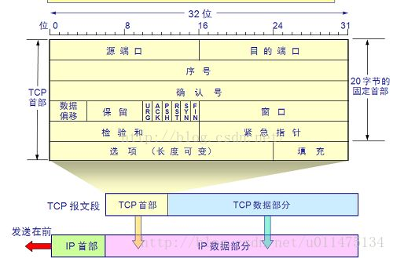

# OSI 五层模型

1. 应用层：应用层协议定义了`应用进程间的交互规则`，通过传输层中应用进程间的交互来完成特定网络应用
   - 如：http协议、DNS域名系统
2. 传输层：运输层的主要任务就是负责向两台主机`进程之间的通信`提供`数据传输`服务
   - 主要有UDP/TCP两种协议
3. 网络层：网络层协议主要实现了不同主机间的通信功能。
   - 如接入网络的主机都会被分配一个 IP 地址的`IP协议`
   - 决定数据报从源到目的地所流经的路径的`路由选择协议`
4. 数据链路层：负责`同一子网`下的两台主机的数据传输
5. 物理层：负责高低电平传输数据


# 在浏览器中输入了URL后会进行哪些技术步骤

1. 解析 URL，确定 `协议，主机域名，端口号，资源路径`
2. DNS域名解析
3. 浏览器主机根据 ip 地址和端口号与服务器三次握手建立TCP连接
4. 发送HTTP 请求
5. 服务器处理请求，生成HTTP 响应报文并返回
6. 浏览器解析文件


# 应用层

## http请求和响应

- 请求信息：
  1. 请求行：由请求方式、URL、http协议版本组成
  2. 请求头：补充请求的信息，由多对键值对组成
  3. 请求体：


- 响应信息：
  1. 状态行：http协议版本，状态码，状态码的描述文本
  2. 响应头：补充响应的信息，由多对键值对组成
  3. 响应体：服务器响应给客户端的资源内容


### http常见请求方式

| **序号** | **方法** | **描述**                                                     |
| -------- | -------- | ------------------------------------------------------------ |
| 1        | GET      | **(查询)**发送请求来获得服务器上的资源，请求体中不会包含请求数据，请求数据放在协议头中。 |
| 2        | POST     | **(增加)**向服务器提交资源（例如提交表单或上传文件）。数据被包含在请求体中提交给服务器。 |
| 3        | PUT      | **(修改)**向服务器提交资源，并使用提交的新资源，替换掉服务器对应的旧资源。 |
| 4        | DELETE   | **(删除)**请求服务器删除指定的资源。                         |
| 5        | HEAD     | **(检测)**HEAD方法请求一个与GET请求的响应相同的响应，但没有响应体。用于不获取响应体而进行较快的检测 |
| 6        | OPTIONS  | **(检测)**获取http服务器支持的http请求方法，允许客户端查看服务器的性能，比如进行复杂请求时的预检等。 |
| 7        | TRACE    | **(诊断)**沿着到目标资源的路径执行一个消息环回测试，主要用于测试或诊断。 |


### http响应状态码

| **分类** | **分类描述**                                                 |
| -------- | ------------------------------------------------------------ |
| 1**      | **信息**，服务器收到请求，需要请求者继续执行操作（实际开发中很少遇到1** 类型的状态码） |
| 2**      | **成功**，操作被成功接收并处理                               |
| 3**      | **重定向**，需要进一步的操作以完成请求                       |
| 4**      | **客户端错误**，请求包含语法错误或无法完成请求               |
| 5**      | **服务器错误**，服务器在处理请求的过程中发生了错误           |

如常见的 ：

- 200 OK
- 301 永久移动、 302/303/307暂时移动、304未修改
- 404 页面不存在、400语法错误或参数错误、403服务器已经收到拒绝执行
- 500 服务器错误


关于302、303、307的解释：（注意这里的重定向请求都是get）

http 1.0里面302具有二义性，在http 1.1中加入303和307就是为了消除二义性。

- 在HTTP 1.0的时候，302的规范是原请求是 post 则不可以自动重定向，但是服务器和浏览器的实现是运行重定向。
- 把HTTP 1.0规范中302的规范和实现拆分开，分别赋予HTTP 1.1中303和307，
  - 303继承了HTTP 1.0 中302的实际实现（即原请求是post，也允许自动进行重定向，结果是无论原请求是get还是post，都可以自动进行重定向）
  - 而307则继承了HTTP 1.0中302的规范（即如果原请求是post，则不允许进行自动重定向，结果是post不重定向，get可以自动重定向）


## DNS 服务

DNS服务器的主要任务就是找到网址域名对应的ip地址。

DNS 本地的客户端被称为解析器，被包含在操作系统的标准库中，调用解析器后，就会向最近的 DNS 服务器发起请求了。


### 解析器的原理

解析器在被调用时会委托操作系统的驱动执行，将消息发送到DNS 服务器上。而请求 DNS 服务器时也需要它的 ip 地址，这个是需要预先设置的。


### DNS 服务器的原理

DNS 服务器首先会从已有的缓存中查找域名，如果存在就会直接返回。

如果找不到，那么就只能通过多台DNS服务器互相配合实现了：

- DNS 服务器的所有信息都是按照域名层级来划分的，一个点就代表了一层，越靠右的层级越高；
- 每个域都是不可分割的，一个域的信息只能被存在一个DNS 服务器上，但是可以通过他的下一级域来实现分割。
  - 如 `www.baidu.com`就是 根域下 com 域下 baidu 域下的 www 域。
- 上一级域的 DNS 服务器会将下一级域的 ip 地址保存起来；
- 根域的 ip 地址被保存在所有 DNS 服务器中。
- 最上级的域称为根域，他没有名字，一般会被省略；
  - 如`www.baidu.com.`才是百度的完整写法，但是后面的点经常会被省略
- 通过以上的概念我们就知道，我们只需要找到任意一台 DNS 服务器，如果它没有直接保存某个域名，就将请求转发到根 DNS 服务器，一路向下查找
  - 如果请求到的 DNS 服务器没有直接存储某个域名，但是符合自己保存的子域的域名，会返回子域的 DNS 服务器的 ip 地址，以此不断往下。
  - 目标DNS 服务器是倒数第二个域名，如百度中的`baidiu`，因为最后的 www 域名肯定只有一个，没有意义，所以找到`baidu`这个目标DNS服务器后就会返回需要的 ip 地址了。


## DNS 为什么使用UDP 协议作为传输层协议

主要原因是为了效率


## http1.0  http1.1  http2.0 之间的区别

1.1 与 1.0的区别主要是在支持长连接上，http1.0 默认短连接，但是可以通过请求头设置keep-alive 来要求不断开连接，而1.1默认长连接

2.0 与 1.1的区别：

- 二进制协议

  - HTTP/2 最大的变化是==重新定义了格式化和传输数据的方式==，这是通过在高层 HTTP API 和低层 TCP 连接之间引入二进制分帧层来实现的.
  - HTTP/1 的请求和响应报文，都是由起始行、首部和实体正文（可选）组成，各部分之间以文本换行符分隔。
  - 而 HTTP/2 将数据==分割为更小的帧==，且对它们采用==二进制编码==，每个帧都包含帧首部，其中会标识出当前帧所属的流。如下图所示，一个 http/1 的请求在 http/2 中被分成了两个帧。
  - 
- 多路复用与数据流

  - http1.1 没有数据流的概念。请求 - 响应必须按照顺序发送。
    - 因此虽然支持了长连接，但是服务器只有处理完一个请求的响应后，才会进行下一个请求的处理，就会出现队头堵塞的问题
    - 在http1.1 中我们会引入雪碧图、将小图内联、开启多个TCP连接、使用多个域名等等的方式来增加 tcp 链接，减少这种顺序带来的影响。
  - 而 HTTP/2 实现了多路复用，即HTTP/2 复用 一个TCP 连接，这依赖的就是数据流的概念
    - 我们将存在于连接中的一个虚拟的通道，称为一个==数据流==，每个数据流都有独特的标识。
    - 客户端和服务器都可以同时发送多个请求或回应，且因为每个桢上都带有其所在数据流的标识，因此不会搞混。不需要维护顺序来避免混乱。
    - 多路复用使得一个域名下的 tcp 链接基本上只需要一条。
    - TCP 协议的稳定性使得它适合用来长时间传输大数据，而HTTP/1 时代太多短而小的 TCP 连接，反而更多地将 TCP 效率低的缺点给暴露出来了。
  - 此外，由于客户端的网络带宽决是固定的，当有多个请求并发时，一个请求占的流量多，另一个请求占的流量就会少。 而 http2 在同一条 tcp 连接上有流量控制，可以对不同的流的流量进行精确控制。
- 头信息压缩

  - HTTP/1 协议头部使用==纯文本格式，没有任何压缩==，且由于 HTTP 1.1 协议是完全的无状态性，==每次请求或响应会包含很多冗余信息==（例如 Cookie、UserAgent 每次都会携带）
  - HTTP/2 引入了头信息压缩机制。头部信息被==压缩成了二进制的形式==，而且客户端和服务器同时==维护一张头信息表==，所有字段都会存入这个表，通过生成一个索引号，本地查询的方式代替不断发送同样字段的http请求，提高速度。
- 服务器推送

  - HTTP/2 的多路复用特性，使得服务器主动推送可行了。但是需要注意的是 http2 下服务器==主动推送的是静态资源==，和使用 WebSocket 向客户端发送即时数据的推送是不同的。


## https加密原理（TLS/SSL）

[原文](https://zhuanlan.zhihu.com/p/43789231)

https是基于http协议的，不过它会使用 TLS/SSL 加密层来对数据加密。

简单来说就是：

1. 浏览器通过数字证书获取到服务器的公钥，而服务器拥有对应的私钥（非对称加密）
2. 他们两者通过这种非对称加密的方式传递一个用于对称加密的密钥X，这样就能确保只有二者知道这个对称加密的密钥了

​	而网站在使用HTTPS前，需要申领一份**数字证书**，数字证书里含有证书持有者信息、公钥信息等。服务器把证书传输给浏览器，浏览器从证书里获取公钥就行了


**TLS/SSL握手过程**

1. 第一步，客户端向服务器发起请求，请求中包含生成的一个随机数、客户端支持的 tls 版本
2. 第二步，服务器端接收到请求后，并给出一个服务器的证书、生成的随机数和服务器选择的密码组合。
3. 第三步，客户端验证服务器证书有效后，生成一个新的随机数，并使用数字证书中的公钥，加密这个随机数（==只有第三次的随机数是被加密的==），然后发给服务器。
4. 第四步，服务器使用自己的私钥解密客户端发送过来的随机数。
5. 第五步，客户端和服务器端==将前面的三个随机数根据互相确认的加密方法生成对称加密的公钥==，以后的对话过程都使用这个秘钥来加密解密信息。


**每次传输时都要进行TLS/SSL层握手传输密钥吗**

​	不需要。因为传递过第一次时，服务器会为每个浏览器（或客户端软件）维护一个session ID，在SSL握手阶段传给浏览器。之后，服务器保存该SessionID及对应相应的密钥。之后浏览器每次请求都会携带session ID，服务器会根据session ID找到相应的密钥并进行解密加密操作


## websoket

​	WebSocket是HTML5的协议，支持长连接。目的是取代HTTP在双向通信场景下的使用。达到服务器主动传送信息给客户端的效果。

​	http 1.1 虽然也默认支持了长连接，但是本质还是请求响应式的。这样在进行实时性强的任务时，只能采取轮询（客户端不断发起请求看有没有新消息）或长轮询（相比于轮询，采取的是阻塞模型，客户端发起请求后，如果没有消息，服务器就不会返回响应）的方式，不是很方便。

​	与HTTP不同的是，Websocket 是一种==有状态的协议==。通过一个 HTTP 请求 建立了 TCP 连接之后，之后的交换数据都不需要再发 HTTP 请求，而是直接发送数据了。

​	**WS的连接不能通过中间人来转发，它必须是一个直接连接**。建立连接后，通信双方可以在任何时候向另一方发送数据。

​	webscoket 的==握手采用http来实现（为了兼容性）==，客户端的握手消息就是一个**普通的，带有 Upgrade 头的，HTTP Request消息**。而服务器响应的也是一个带有 **Upgrade头**的 http 响应，但是==状态码是 101== ，表示切换协议。

​	

## cdn

如果用户访问的网站部署了 CDN，过程是这样的：

1. 浏览器要将域名解析为 IP 地址，所以需要向本地 DNS 发出请求。
2. 本地 DNS 向 DNS 服务器发出请求，得到==全局负载均衡系统==（GSLB）的 IP 地址。
3. 本地 DNS 再向 GSLB 发出请求，它根据本地 DNS 的 IP 地址判断用户的位置，筛选出距离用户较近的==本地负载均衡系统==（SLB），并返回它的 ip 地址。
4. 本地 DNS 将 SLB 的 IP 地址发回给浏览器，浏览器向 SLB 发出请求。
5. SLB 根据浏览器请求的资源和地址，选出最优的缓存服务器发回给浏览器。然后返回浏览器一个重定向到该缓存服务器的响应
6. 如果缓存服务器有浏览器需要的资源，就将资源发回给浏览器。如果没有，就向源服务器请求资源，再发给浏览器并缓存在本地。、

因此我们知道，cdn 主要通过一个负载均衡系统来判断出离用户最近的一个缓存服务器，这样就能提高用户的访问速度了。


## 身份认证

### http协议的无状态性

​	http协议是请求/响应模式，而http协议的无状态性指的是客户端==每次http请求都是独立的==，服务器不会主动保留每次http请求的状态。

​	由于我们无法在每一次 http 请求中都进行登陆操作，因此在一次登陆后通常会让浏览器在之后的某段时间内发送的所有 http 请求都包含客户端相关信息的数据，进行身份认证，服务器通过解密这些数据，在这一次请求中获得用户的数据，进行相应的响应。


### cookie和session认证

**cookie**

​	Cookie是**存储在用户浏览器中**的一段不超过4 KB的字符串。它由一个名称（Name）、一个值（Value）和其它几个用于控制Cookie有效期、安全性、使用范围的可选属性组成。==不同域名下的 Cookie 各自独立==。

特点：

1. 自动发送
2. 域名独立
3. 过期时限
4. 4KB限制

由于cookie是存储在浏览器中的，而且浏览器也提供了读写cookie的API，所以cookie安全性低。


**session**

​	session需要配合cookie实现。

​	session的工作原理：浏览器首次发送请求到服务器，==服务器端创建一个sessionID和 cookie，发送 cookie 到浏览器，服务器保存cookie 跟 session 的对应关系==；浏览器再次请求并携带带有特殊 id 的cookie，服务器根据 cookie中 的 id，查看对应的session对象，读取session的数据达到身份认证的目的。

​	为什么 session 安全系数就高呢？ 它明明也是 cookie 实现的。

​	答案是 cookie 的内容和有效时间不同。

- 在cookie 验证中，cookie 内保存的内容直接就是用户的有关信息，由于 cookie 是保存在客户端的，因此容易被读写，所以并不安全。
- session 认证中，cookie 存储的是 session 的 id ，发送到服务器后，服务器会根据这个 id 找到相关的 session ，拿到用户的信息，由于 session 是保存在服务器的，因此安全系数高；而 cookie 只是保存了没有意义的 id ，因此不担心被读写。


### JWT认证

​	由于session是基于cookie实现的，而cookie是域名独立的，所以默认不支持跨域，且同一域名下的不同服务器也无法共享存储的 sessionID 。而JWT是用于解决跨域请求的认证问题的。

​	 此外，session 的数据存储在了服务端中，对服务端压力较大。而 jwt 字符串仍然存储在客户端中，分散服务器压力。

​	此外，由于 JWT 是可信的，因此可以用于交换一些非敏感信息，还可以利用数字签名验证内容是否被修改

​	JWT的Token字符串组成：

```js
// 三部分组成：Header（头部）、Payload（有效荷载）、signature（签名）
Header.payload.Signature
// Header 声明是 JWT 令牌，描述使用的签名加密算法，是一个 json 对象，至少经过了 base64 编码
// Payload 是用户信息，默认不加密，因为 jwt 主要用途不是加密数据，如果需要数据保护，可以使用 https。它也是一个 json 对象，至少经过了 base64 编码
// Signature 数字签名，对上面两编码后的部分按照头部声明的算法进行加密，在服务端会进行这一步骤，如果发现签名和自己计算一遍得到的数据不一样，则认为字符串已经被修改。数字签名保证了令牌不被伪造和篡改
```


​	数字签名可以使用对称或非对称加密算法，这个在 jwt 字符串的头部部分已经被声明了。

- 如果是非对称加密，则客户端可以在本地使用公钥进行解密，验证签名是否正确
- 如果是对称加密，则客户端无法解密或验证，只能将其发给服务端进行身份认证。


JWT不仅可用于认证，还可用于信息交换。善用JWT有助于减少服务器请求数据库的次数。

JWT的最大缺点是服务器不保存会话状态，所以在使用期间不可能取消令牌或更改令牌的权限。除非服务器部署额外的逻辑

jwt 只保证不被篡改，不能保证不被盗用，所以我们需要其他的办法保证不被盗用。一般使用HTTPS协议来传输代码。且一般有效期不会设置太长。


JWT 相较于 Session ：

1. 无需在服务端存储信息
   - 意味着身份认证的过程可以不访问服务端的数据库，只需解密验证，时间换空间
   - jwt 是可靠的，因此也可以携带一些信息，来供服务器直接使用；而 session 无法做到
   - 应用程序分布式部署的情况下，也不需要像 session 一样做多机数据共享；
   - 但是缺点是一旦 JWT 签发了，到期之前就会始终有效，无法废弃，除非服务器部署额外的逻辑
2. 安全性：
   - JWT 虽然是存储在客户端的，但是通过数字签名保证了其可靠性；而 session 直接通过将信息存储到服务器来保证可靠性。
   - 但是他们俩都不管信息的加密或盗用问题，如果又这种需求，应该使用 https 协议解决。
   - jwt 是存放在客户端的，因此不应该存放敏感信息
3. 跨域
   - session 是基于 cookie 的，而 cookie 默认不支持跨域，不会自动发送 cookie ；而 jwt 本身没有跨域问题
   - Session 认证无法经过中间节点，即用户无法通过第三个节点访问。


# 传输层

## tcp/ip 设计     的基本思路

tcp/ip 主要思路是将一些子网通过路由器不断连接形成的一个大网络。（这里的子网一般指由集线器连接起来的几台计算机）。

而 ip 地址就是网上的设备被分配的地址。他由32bit ，四字节的数字。每一字节通过圆点隔开。

由于ip地址中不固定网络号和主机号的位数，无法确定两者，因此出现了子网掩码。子网掩码的左部分全为1，右部分全为 0 。ip地址中对应 1的部分表示网络号，0 的部分主机号。

此外，如果主机号全部为 0 表示整个子网；全部为 1 表示广播。

~~~js
10.11.12.13 // ip 地址
10.11.12.13/255.255.0.0 // 右边是子网掩码
10.11.12.13/24 // 子网掩码可以通过比特数表示
~~~


## UDP 和 TCP 的特点与区别

**用户数据报协议 UDP（User Datagram Protocol）**

1. 面向报文的（对于应用层传下来的报文不合并也不拆分，只是添加了一层 UDP 首部）；
2. 无连接，单向传输，因此减小了时间开销，也支持一对多、多对多；
3. 尽力而为交付，允许丢包，不保证数据的可靠交付；没有拥塞控制，对UDP报文段的发送速率没有限制
4. 首部短小，UDP首部只有 8 字节
5. 比较适合一些实时的应用，和小文件传输。

**传输控制协议 TCP（Transmission Control Protocol）**

1. 是面向连接的，比如三次握手，四次挥手。每一条 TCP 连接只能是点对点的（一对一）。
2. 面向字节流（把应用层传下来的报文看成字节流，把字节流组织成`大小不等`的数据块（分组、报文段））
3. TCP通过ARQ协议、流量控制、拥塞控制提供可靠的传输，但是导致效率偏低
4. 提供全双工通信，（可以一边发送一边接收，连接双向的）
5. TCP首部一般为20字节


## UDP/TCP首部格式

- UDP首部只有8字节，包括
  1. 源端口（因为是单向传输所以也可以为空）
  2. 目的端口
  3. 总体长度（首部和应用数据的大小）
  4. 检验和（只用于校验，不用于恢复）
- TCP首部（一行4B 32位，最小为5行（20字节））：
  1. 源端口和目的端口（端口号用于识别一个计算机中的不同网络程序）
  2. 32位序号（seq）,表示本报文段所发送数据的==首个字节==的序号。（==TCP的序号是对字节进行编号的==）
  3. 32位确认序号（ACKnum）（如果 ACK 置1）指期望收到对方下一个报文段的序号。
  4. 数据偏移：数据部分距离报文起始处的偏移量，实际上指的就是首部长度
  5. 六个控制位（ACK是对数据包的确认，SYN表示发起一个新的连接，FIN表示结束连接）
  6. 窗口：表示自己的窗口信息
  7. 检验和（只用于校验，不用于恢复）




## 什么是TCP的三次握手和四次挥手

**三次握手建立连接：**

1. 客户端向服务器发送连接请求，进入 `SYN_SENT` 状态
   - SYN置1表示发起连接，seq 随机生成初始序号 x
   - ACK为0，因为没有需要响应的内容
2. 服务器收到请求报文，如果同意连接，向发送方发送确认报文，确认号为 x+1，同时也随机生成一个初始的序号 y。服务器进入 `SYN_RCVD` 状态
   - SYN为1表示发起连接，seq 随机生成初始序号 y，
   - ACK为1表示确认信息，ack 为 x + 1
3. 客户端收到服务器的确认报文后，再向服务器发出确认，确认号(ack)为 y+1，序号(seq)为 x+1。发送完的客户端进入 `Established` 状态。待服务器收到客户端发送的 `ACK` 包也会进入 `ESTABLISHED` 状态，完成三次握手。此外，第三次握手可以顺便传输数据
   - ACK = 1 , seq = x + 1; ack = y +1

**为什么是三次？**

- 三次握手让双方都能明确自己和对方的收发能力都是正常的（因为只有接受到数据的一方能推断出来）
- 互相确认初始序号。如果第二次握手报文丢失，那么客户端就无法知道服务端的初始序列号，那 TCP 的可靠性就无从谈起。
- 防止历史连接的初始化：网络环境复杂，可能导致旧的 SYN 数据包先到达服务器。如果是两次握手，服务器收到旧的 `SYN` 就会立刻建立连接，那么会造成网络异常。
- 安全问题：如果采用两次握手，就建立连接，那会增加 DDOS 攻击的可能。


**四次挥手关闭连接**

1. 客户端要关闭连接时，会发送断开请求。客户端进入 `FIN_WAIT_1` 状态
   - FIN = 1
   - seq为客户端发送时增长到的序号，设为m
2. 服务器回复确认信息。服务器端进入了 `CLOSE_WAIT` 状态，客户端收到这条消息，会进入 `FIN_WAIT_2` 状态，无法再发送新的数据了，而只能接受
   - ACK = 1，表示确认收到的数据包有效
   - ack = m + 1；表示期望收到 序号为 m + 1序号的数据
3. 服务器传送完毕所有的信息后给客户端发送请求结束的报文，服务器此时进入了 `LAST_ACK` 状态。
   - FIN = 1
   - seq  为服务器发送时增长到的序号，设为n
4. 客户端返回确认报文，并进入 `TIME_WAIT` （等待）状态（等两个时间周期）然后关闭连接
   - 返回ACK = 1； ack = n + 1

**为什么要等呢**

- 因为如果客户端最后一个确认报文如果丢失，服务器没有收到确认报文，就会超时重传一个新的请求结束报文，此时客户端就可以重新返回确认报文；如果不等待，服务器有可能收不到客户端的信息而无法正常关闭
- 避免旧连接混淆：等待时间可以使本连接持续的时间内所产生的所有报文都从网络中消失，使下一个新的连接中不会出现这种旧的连接请求报文。

**为什么要四次挥手呢？**

在主动关闭方发送 FIN 包后，接收端可能还要发送数据，因此==不能将 FIN 和 ACK 包一起发送==。


## TCP粘包、拆包及解决办法

**为什么UDP没有粘包拆包的情况？**

​	UDP是基于报文发送的（即将整个报文包一个UDP头就发送），`UDP头部记录了数据报文的长度`，应用层能很好的将不同数据分开


**什么是粘包、拆包**

- 粘包是发送方发送了两个数据包，接收方只收到一个数据包，这个数据包包含了两个数据包的信息
- 拆包是接收方收到了发送来的两个数据包，但是一个是不完整的，一个是多出来一块的（粘包拆包一起发生了）


**为什么会发生粘包和拆包**

由于TCP是面向字节流的，所以底层是无法保证数据包不被拆分和重组的，这个问题只能通过上层的设计来解决（http 首部）。

- 要发送的数据大于 TCP 发送的滑动窗口的缓冲区剩余空间大小，将会发生拆包。
- 待发送数据大于 MSS（最大报文长度），TCP 在传输前将进行拆包。
- TCP 将多个写入缓冲区的数据一次发送出去，将会发生粘包。


**解决办法**

上层的解决方案：

- `消息定长`，不够的用0补充；
- 设置`消息边界`，在`包尾增加回车换行符`进行分割
- 消息中包含该消息总长度


## 滑动窗口

滑动窗口分为接收方的滑动窗口和发送方的滑动窗口。

- 接收方的滑动窗口是为了在处理和接收数据的不同速度中使用内存取得一个平衡；接收窗口前面部分组已经发送确认并交付主机，就向后滑动
- 而发送方的滑动窗口是为了在一定范围内实现不收到响应而仍能正常发送数据的能力。发送窗口在发送数据，并接收到响应时向后滑动


### ARQ协议（超时重传）选择重传协议

TCP 的可靠运输机制是基于连续 ARQ 协议和选择重传协议实现的。

ARQ协议分为停止等待 ARQ 协议和连续 ARQ 协议。

- 停止等待 ARQ 协议

  - 发送方每发送一个分组，就为这个分组设置一个定时器。当发送分组的确认回答返回了，则清除定时器，发送下一个分组（`相当于一个大小为1的滑动窗口`）。如果在规定的时间内没有收到已发送分组的肯定回答，则重新发送上一个分组。
  - 每次发送分组必须等到分组确认后才能发送下一个分组，效率过低。


- 连续 ARQ 协议

  - 连续 ARQ 协议会在一定范围内连续发送一组分组，也就是发送方的滑动窗口
  - 发送方的滑动窗口需要处理分组中可能出现的差错恢复情况。
    - 在发送方维持了一个发送窗口，包含`已发送未确认`的分组和`允许发送但待发送`的分组
    - 当发送方发送分组时，会依次发送窗口内的所有`允许发送但待发送`的分组，并且设置一个定时器，这个定时器可以理解为是最早发送但未收到确认的分组的定时器。
    - 如果在定时器的时间内收到某一个分组的确认回答，则滑动窗口，将窗口滑动，直到第一个分组不是已发送并且已确认的状态。
    - 此时如果还有已发送但没有确认的分组，则==重新设置定时器==；如果没有了则关闭定时器；如果定时器超时，则==重新发送所有已经发送但还未收到确认的分组==。

  

  - 接收方使用的是累计确认的机制，
    - 对于每一个==按序到达的分组==，接收方返回一个分组的肯定回答；如果收到了一个乱序的分组，那么接方会==直接丢弃==，并再次返回一个==最近的按序到达的分组的肯定回答==。（保证了该确认号以前的数据是有序的）
    - 缺点是：如果只是一个分组丢失，而后面的分组都按序到达的情况的话，接收方仍会丢弃所有没有按序到达的数据包，造成浪费。

- 选择重传协议：
  - 选择重传协议与滑动窗口协议最大的不同是，发送方发送分组时，==为每一个分组都创建了一个定时器==。
  - 当发送方接受到一个分组的确认应答后，取消该分组的定时器，并判断接受该分组后，是否存在由窗口首部为首的==连续的确认分组==，如果有则向后移动窗口的位置，
  - 如果没有则==将该分组标识为已接收的乱序分组==。等待其他分组的确认使得确认连续。
  - 而接收方不会采用累计确认的方式，而是对每一个到达的分组都进行响应。


## TCP流量控制

- 流量控制是为了控制发送方发送速率，保证接收方来得及接收。
- TCP是通过==接受方维护的滑动窗口来实现流量控制==。主要的方式就是接收方返回的响应中会==返回自己的接收窗口的大小==，发送方会根据这个值和其它相关信息设置自己的窗口大小。


## TCP 拥塞控制

如果网络出现拥塞而不加以控制，分组将会丢失，而发送方会继续重传，导致网络拥塞程度更高。

**四种算法：**慢开始、拥塞避免、快重传、快恢复

​	发送方需要维护一个拥塞窗口（cwnd）的状态变量，注意：实际发送方能发多少数据仍是由发送方窗口决定的（==发送方窗口大小保持等于 cwnd==）。

1. **慢开始**：cwnd赋初始值，每个轮次cwnd大小按==指数==型增长一次，还需要设置一个==慢开始门限==ssthresh，大于等于该门时进入拥塞避免
2. **拥塞避免**：每个轮次只让cwnd线性==增长==一次，出现了超时则==重置 ssthresh==（依据当前cwnd的值），并==重置cwnd为初始值==。

针对慢开始与拥塞避免的改进算法：

3. **快重传**：
   - 如果==出现丢包而不是超时==，按照上面的两种算法就会进行重置；快重传是考虑了丢包的情况。
   - 快重传指的是发送方尽快进行重传，而不是等到超时重传计时器超时再重传。
   - 要求接收方即使收到了失序的报文段，也要立即发出对已收到有序的报文段的重复确认，以便甄别是网络拥塞还是丢包
   - 发送方一旦连续收到`三个连续的重复确认`（==确认为丢包而且不是网络堵塞==），就将响应的报文段进行重传，而不是等待该报文段的超时重传。
4. **快恢复**：发送方收到三个重复确认，就知道只是丢失了个别的报文段，而不是网络拥塞，于是==不启动慢开始算法==，而是==快恢复算法==快速进入拥塞避免算法。


